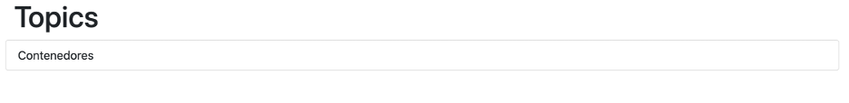

# 🐳 Laboratorio Contenedores - Misiones del final del módulo 🕵🏻‍♀️🫆


>[!IMPORTANT]
> Antes de lanzarte a contenerizar todo, ¡relájate y prueba la aplicación tal como está! 😌 Lo único que necesitas es tener MongoDB funcionando. Empieza creando MongoDB en Docker y usa un cliente como MongoDB Compass (¡que ya viste en clase!) para añadir datos que tu API pueda devolver. A partide aquí ya estás list@ para comprobar lo que has aprendido.

## 🎯 Misión 1: Dockeriza como un Pro

¡Es hora de poner en práctica todo lo aprendido! 💪 Vas a dockerizar una aplicación completa dentro de [lemoncode-challenge](./), que está compuesta de 3 partes increíbles:

- 🌐 **Frontend**: Una interfaz con Node.js
- ⚙️ **Backend**: Elige tu aventura - .NET (`dotnet-stack`) o Node.js (`node-stack`) que se conecta con MongoDB
- 🗄️ **Base de datos**: MongoDB para almacenar toda la información

> 💡 **¡Libertad de elección!** Como habrás notado, tienes dos carpetas: `dotnet-stack` y `node-stack`. El frontend es idéntico en ambos casos, solo cambia el backend. ¡Elige el que más te motive!

### 📋 Misión: Cumple estos requisitos

1. 🌐 Los tres componentes deben vivir en armonía en una red llamada `lemoncode-challenge`
2. 🔗 El backend debe comunicarse con MongoDB usando esta URL mágica: `mongodb://some-mongo:27017`
3. 🚀 El frontend debe conectar con la API mediante: `http://topics-api:5000/api/topics`
4. 🌍 El frontend debe ser accesible desde tu navegador en el puerto `8080`
5. 💾 MongoDB debe persistir los datos en un volumen mapeado a `/data/db`
6. 📊 Crea una base de datos llamada `TopicstoreDb` con una colección `Topics` que tenga esta estructura:

```json
{
  "_id": { "$oid" : "5fa2ca6abe7a379ec4234883" },
  "topicName" : "Contenedores"
}
```

🎉 **¡No olvides añadir varios registros para hacer tu app más interesante!**

__Tip para backend__: Antes de intentar contenerizar y llevar a cabo todos los pasos del ejercicio se recomienda intentar ejecutar la aplicación sin hacer cambios en ella. En este caso, lo único que es posible que “no tengamos a mano” es el MongoDB. Por lo que empieza por crear este en Docker, usa un cliente como MongoDB Compass para añadir datos que pueda devolver la API.


> 💎 **Pro Tip**: Abre Visual Studio Code directamente desde la carpeta `backend` para hacer las pruebas. ¡Te ahorrará tiempo! Para ejecutar el código:
> - .NET stack: `dotnet run` 
> - Node.js stack: `npm install && npm start`

**🎨 Para el Frontend**: 
Abre la carpeta frontend en VS Code y ejecuta `npm install` para instalar las dependencias. Luego `npm start` y ¡voilà! Tu navegador debería mostrar algo así:



## 🎪 Misión 2: ¡Docker Compose al Rescate!

¡Ahora viene la parte divertida! 🎊 Toma tu aplicación dockerizada de la misión 1 y usa Docker Compose para orquestar todas las piezas como un director de orquesta.

### 🎯 Tu misión incluye:
- 🌐 Configurar la red que conecta todos los servicios
- 💾 Definir el volumen que necesita MongoDB para persistir datos
- 🔧 Establecer las variables de entorno necesarias
- 🚪 Exponer los puertos correctos para web y API
- 📝 Documentar los comandos para levantar, parar y eliminar el entorno

¡Demuestra que eres un maestro de la orquestación de contenedores! 🎭✨
