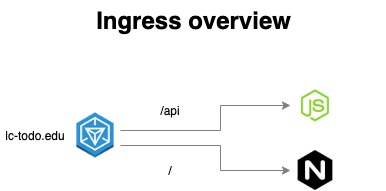

# Ingress

## Enunciado

Construir los distintos recursos de Kubernetes para generar un clúster, como el de la siguiente imagen:

### Para ello seguir los siguientes pasos:

### Paso 1. Crear todo-front.

Crear un `Deployment` para `todo-front`, usar el `Dockerfile` de este directorio **02-distributed/todo-front**, para generar la imagen necesaria. Notar que existe `ARG API_HOST` dentro del fichero `Dockerfile`, lo podemos omitir en este caso, sólo está ahí para poder probar el contenedor de Docker en local.

Al ejecutar un contenedor a partir de la imagen anterior, el puerto expuesto para http es el 80. 

Crear un `Cluster IP Service` que exponga `todo-front` dentro del clúster.

### Paso 2. Crear todo-api.

Crear un `Deployment` para `todo-api`, usar el `Dockerfile` de este directorio **02-distributed/todo-api**, para generar la imagen necesaria.

Al ejecutar un contenedor a partir de la imagen anaterior, el puerto por defecto es el 3000, pero se lo podemos alimentar a partir de  variables de entorono, las variables de entorno serían las siguientes

* **NODE_ENV** : El entorno en que se está ejecutando el contenedor, nos vale cualquier valor que no sea `test`
* **PORT** : El puerto por el que va a escuchar el contenedor

(_Opcional_) Crear un `ConfigMap` que exponga las variables de entorno anteriores. 

Crear un `Cluster IP Service` que exponga `todo-api` dentro del clúster.

### Paso 3. Crear un Ingress para acceder a los servicios del clúster

Crear un `Ingress` para exponer los servicios anteriormente creados. Como referencia para crear este controlardor con `minikube` tomar como referencia el siguiente ejemplo [Set up Ingress on Minikube with the NGINX Ingress Controller](https://kubernetes.io/docs/tasks/access-application-cluster/ingress-minikube/)

