# EC2 Manual Deploy

## Introduction

EC2 stands for Elastic Compute Cloud. EC2 is a web service that provides secure and resizable compute capacity in the cloud. It allows users to obtain and configure server capacity quickly and easily. With EC2, users can launch server instances within minutes to build and host their applications. EC2 reduces the time required to obtain and boot new server instances, allowing users to scale their computing power up or down depending on their needs. Some key aspects of EC2 include:

- EC2 provides users the ability to choose from multiple instance types that vary in computing capacity and price. This allows choosing the right resource for different application needs. 

- Instances can be launched in different AWS Regions and Availability Zones, providing flexibility and reliability. 

- Storage for the instances can be provided through EBS volumes or instance store. EBS volumes provide persistent storage while instance store provides temporary storage.

- Security is managed through firewall rules (Security Groups) and optional encryption of data at rest. 

- Access to instances is provided through SSH and RDP depending on the OS. Users have root access to their instances.
Sources

## Spin up 

Lets spin our first box on AWS cloud, in order to do that we need to search for `EC2 service` and follow the link:

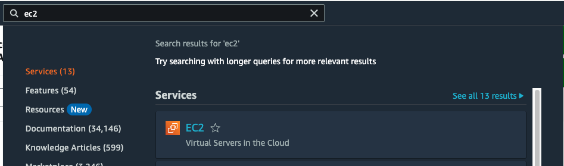

This will move us to `EC2 Dashboard`, from here, we can launch a new instance, scroll down a bit, and click on `Launch instance`

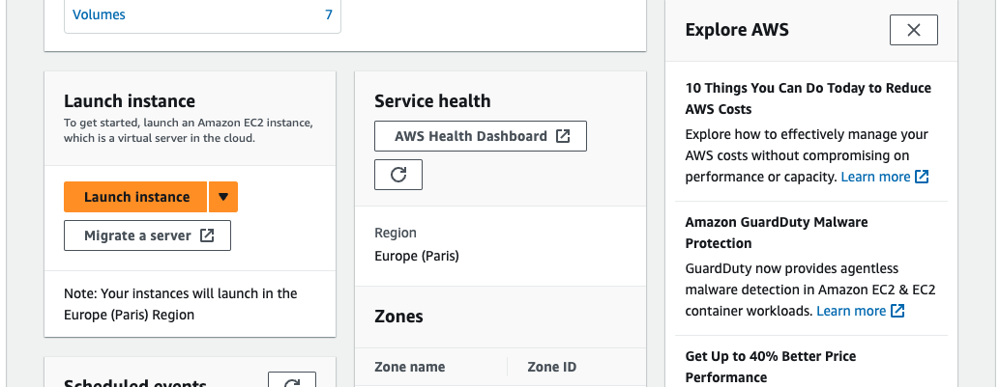

Give it a name `my-instance`

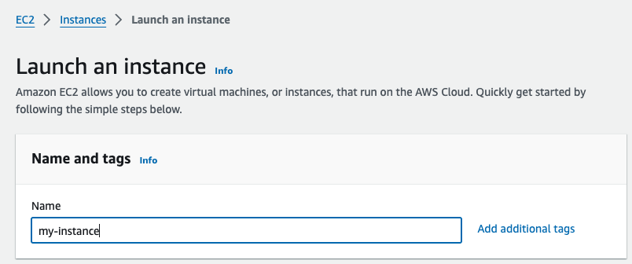

We will keep the defaults for the `AMI` and `Architecture`

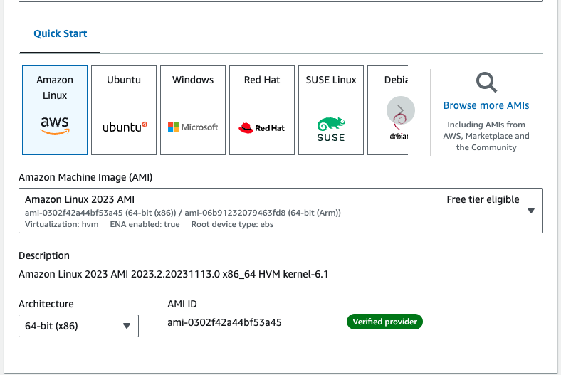

In order to access our EC2 instance, we're going to create a new key pair, soo click on `Create new key pair`

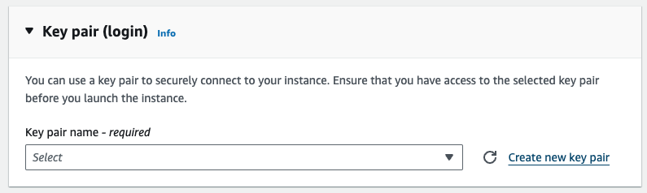

Create `my-key-pair`, once is created the down load starts automatically.

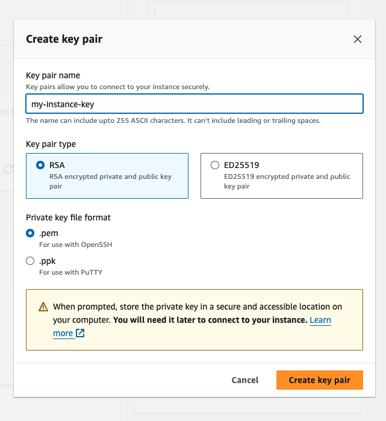

For Network settings we're going to keep the default ones:

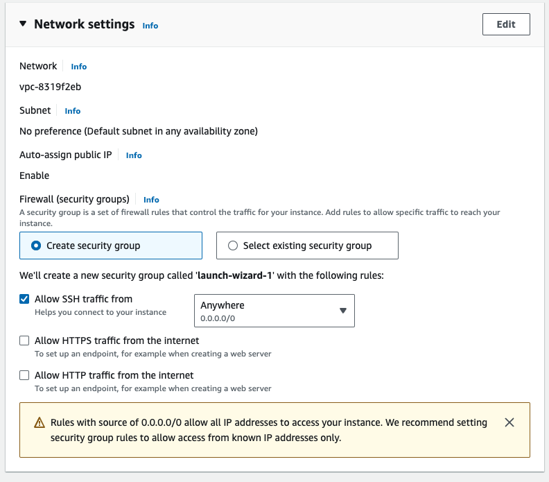

We don't need nothing else to spin up our first EC2, so lets go ahead and click on `Launch instance`. After a few moments a success message must appear:

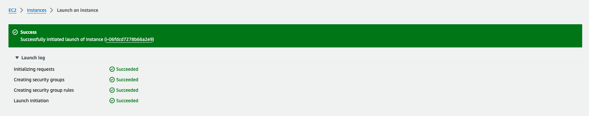

Lets move back to `EC2 dashboard`, here we can see our new instance up and running

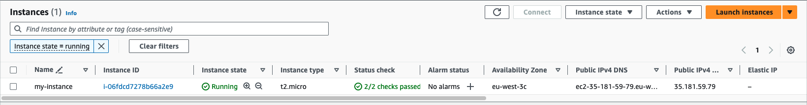

## Accessing

Now it's time to get into our new shinny EC2 instance. For that, select the EC2 instance `my-instance`. Notice once we do this the `Connect` button gets active, click on it:

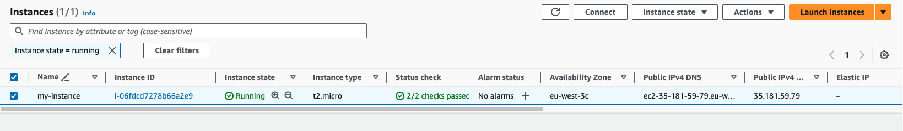

Notice we have different ways to access our machine, lets simply select the first one to have a quick look:

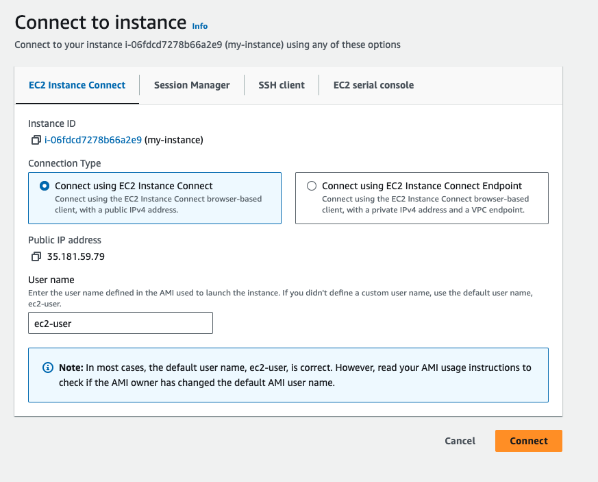

Also it's good to mention, that we have created previously a key pair, and we've associated that key pair with our machine. If we want to connect to our EC2 from our local machine, we just need to follow the instructions that AWS provides on `SSH client` tab. Just to be clear on this point, the machine that we've spun up, is a Linux machine, so the protocol will be `SSH`, but if instead Linux, we choose a Windows machine the protocol will be `RDP`.

Click on `Connect`, after a few seconds we must see an image as follows:

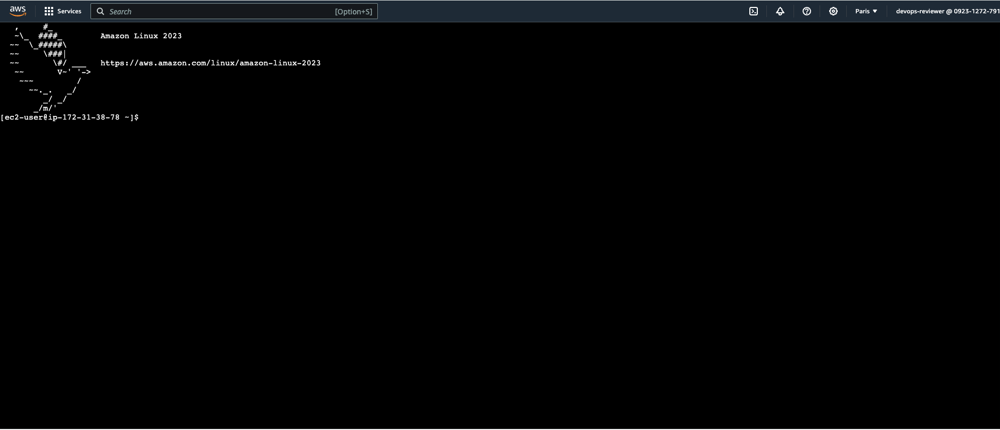

Lets run some commmands:

```bash
curl ifconfig.me
```

The previous command returns the `instance public IP`.

```bash
whoami
```

Notice that our user is `ec2-user`, this is fine. By the way the user name, will depend on picked AMI. Lets try to install Docker and spin up an Nginx server.

```bash
sudo dnf update
sudo dnf install docker -y
sudo systemctl start docker
sudo systemctl enable docker
sudo usermod -aG docker $USER 
newgrp docker
```

```bash
docker run -d -p 80:80 nginx
```

We can check that we can internally hit Nginx by running:

```bash
curl localhost
```

Copy and paste our public IP on browser using `curl ifconfig.me`, we get a timeout.... Hummm, lets discuss next, why is this happenning.

## References

- [Amazon EC2 - AWS GovCloud (US)](https://docs.aws.amazon.com/govcloud-us/latest/UserGuide/govcloud-ec2.html)
- [Amazon EC2 FAQs – AWS](https://aws.amazon.com/ec2/faqs/)
- [Amazon EC2 - How AWS Pricing Works](https://docs.aws.amazon.com/whitepapers/latest/how-aws-pricing-works/amazon-ec2.html)