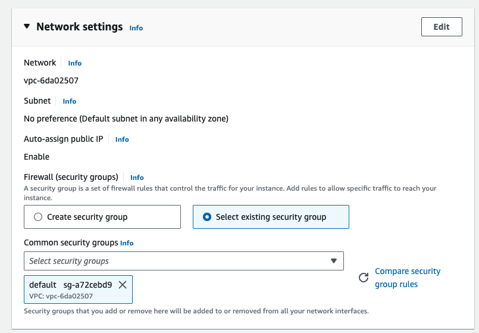
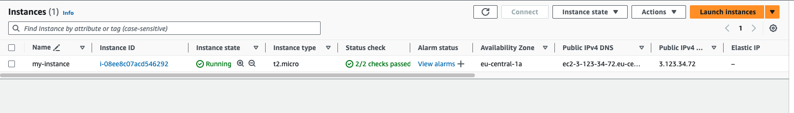
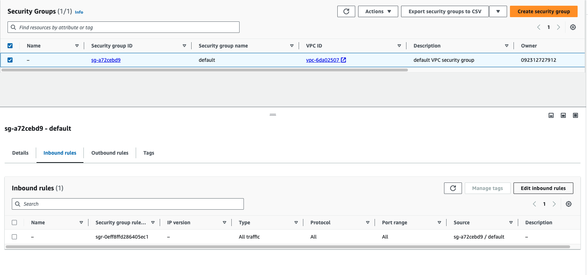
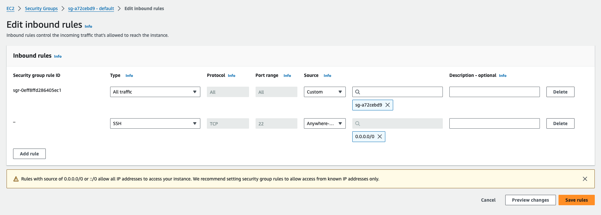

# Demo

1. Open Frankfurt Region
2. Create a new instance using `default security group` and `default VPC` and `Key pair`, name it frankfurt-key
3. Associate a Key to SSH in.



Check the new created instance



We see that it has a `public IP`, and it is in the default security group. We can also see the key name used to SSH to the instance, this is an Ubuntu Linux instance, and we have that key. So let's give it a try. I'll SSH using a key and the information. 

```bash
chmod 400 frankfurt-key.pem
```

```bash
ssh -i "frankfurt-key.pem" ec2-user@ec2-3-123-34-72.eu-central-1.compute.amazonaws.com
```

> We attempt the SSH and nothing happens. 

Let's go check out the security group rules. Sure enough, this is the **default security group**, so **no inbound traffic is allowed outside of the security group**.



Let's edit this rule and change it to allow SSH from my IP address. We'll be sure to add a description and save the rule. Click on `Save`



Now we'll try again, and here we go. 

```bash
ssh -i "frankfurt-key.pem" ec2-user@ec2-3-123-34-72.eu-central-1.compute.amazonaws.com
```

We've successfully connected to our remote instance via `SSH`. 