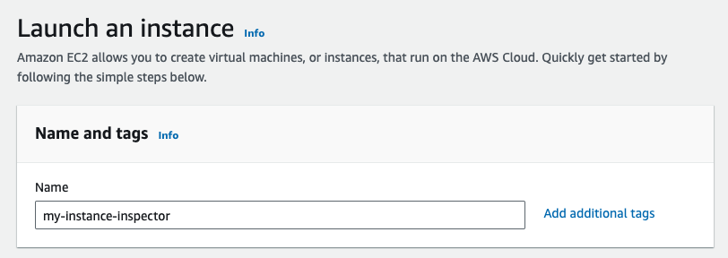
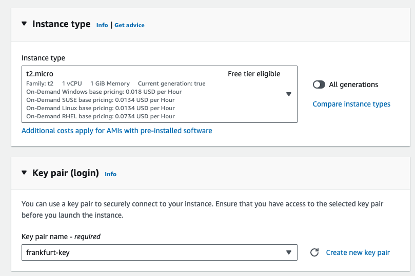
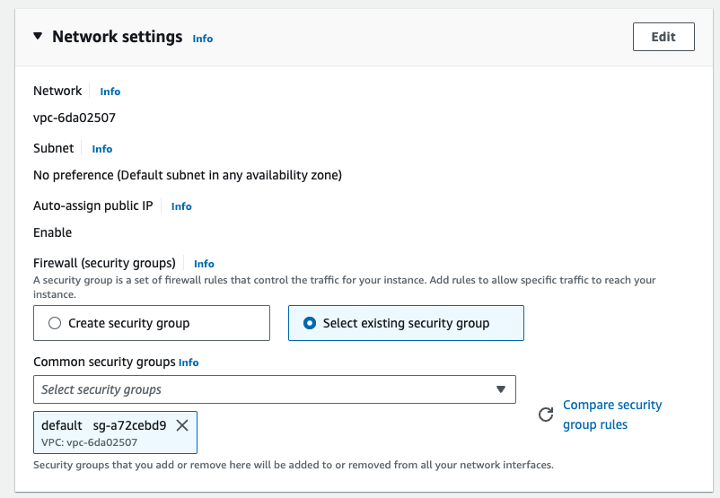

# Demo

1. Start from previous demo.

Lets start by shell into the machine by running:

```bash
ssh -i "frankfurt-key.pem" ec2-user@ec2-3-123-34-72.eu-central-1.compute.amazonaws.com
```

Install Docker 

```bash
sudo dnf update \
sudo dnf install docker -y \
sudo systemctl start docker \
sudo systemctl enable docker
```

```bash
sudo usermod -aG docker $USER
newgrp docker
```

Start Nginx with Docker

```bash
docker run -d -p 80:80 nginx
```

Check local connectivity:

```bash
curl localhost
```

Ok, we have an HTTP server running on port 80. When we're logged in to the EC2 machine and hit `localhost`, it shows us the page that we expect from the web server. 

```bash
curl ifconfig.me
```

We copy instance `public IP`, the page is not showing up and timing out when we try to access it from browser. What's wrong? 

1. Use same Region, Frankfurt
2. Create a new instance using `default security group` and `default VPC` and use `Key pair`, name it `frankfurt-key` name it `my-instance-inspector`





Open a new terminal an SSH into the new machine:

```bash
ssh -i "frankfurt-key.pem" ec2-user@ec2-52-58-134-43.eu-central-1.compute.amazonaws.com
```

Use `curl` with the `public DNS` from previous instance

```bash
curl <public DNS>
```

When I try to hit the public IP of the (previous) Linux machine, my request times out. **There is no rule to allow traffic on port 80**.

> NOTE: Since I'm on the same SG I can reach the `private IP`

Let's **add a rule to allow HTTP traffic on port 80 from the security group.** 

[Select default sg](./.resources/accessing/04.png)

We'll label that the security group we've selected as a source is the default security group and save this rule. 

[Update default sg](./.resources/accessing/05.png)

Now when we refresh the request, we can see the welcome page as expected. 

```bash
curl <public DNS>
```

Now I'll try accessing the page **from a machine that is not in the security group.** From my browser try to open using the `public DNS` My request times out, and I can't see the page. 

If we go in and edit the security group rule again and make it available to all IP addresses, when I go back and try again, I can see the page.

[Update default sg](./.resources/accessing/06.png)

[Update default sg](./.resources/accessing/07.png)