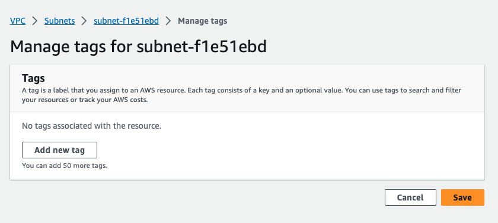

# Demo

Let's go ahead and launch two EC2 instances, one with an internal-only IP, and the other will also have an external IP assigned to it. We will also set up a Bastion Server in our external subnet to access the machine in our internal subnet. 

1. Set up London Region 

Under Services, type vpc and select `VPC`. Notice I'm in the London region, and there is one `VPC`. This is the default VPC that was created by AWS. Notice it has a CIDR block. 


Then if I go and select Subnets, notice there are three different subnets. In the default `VPC`, one subnet is created for each availability zone. Each subnet has a CIDR block, which is a subset of the VPC CIDR block. 


For our demo, we'm going to label one of these `Internal` and the other `External`. Instances that we launch in the internal subnet will only have an internal IP address assigned, and instances that are launched in the external subnet will have both an internal and an external IP. 




 

Now we'll go to EC2, and we'll launch an instance. This is where you will decide what VPC and subnet your instance will launch into and whether or not it will have an external IP address. 


In this case, there is only one VPC. But for subnets, I'm going to select the **external subnet**. This next setting is what determines if your instance is assigned an external IP or not. Each subnet can enable or disable auto-assignment of a public IP. This subnet happens to have that enabled, which is what we want. We'll accept defaults here. Then we'll add a name tag so we can see this in our list of instances and know what it is.  


Security groups, we do not want to create a security group named launch-wizard-1. Let's take a look at the existing security groups to see if something fits what we want to do. Currently, there is only the default security group. So let's create a new security group called `bastion`, and we'll add a description, _Access to the Bastion Server_. And what I want in this security group is only access from my machine to SSH to the `Bastion Server`.


Click on `Launch instance`

Now we'll go back into EC2 and launch another instance. We'll call this instance `Internal`. 


This time, we want to launch the instance into the `internal subnet`. Notice that this subnet is still defaulting to allow external IPs. Here I'm going to **disable the auto-assign IP** here in the launch wizard. We can also go and change that default behavior in the subnet. But for now, we'll just launch the instance. 


Since we don't want to allow any outside access, we're going to create a new security group called `Internal`. For this rule, I'll allow anyone in the `Bastion` security group to have access via `SSH` to our internal security group. 


Click on `Launch instance`


Let's check on the status of our instances that are launching. We can see our Bastion Server has started, and our Internal is in the process of starting up. 

Let's look at the details of these machines. For the Bastion Server, notice that there is an external IP that is assigned to this instance. The private IP is the internal IP address assigned to this instance based on the subnet CIDR block. 


If we look at the details of the internal server, notice that there is no external IP assigned. However, there is an internal IP. Again, the internal IP address is based on the subnet CIDR block where this instance was launched.  


Let's go ahead and log into our Bastion Server using the external IP address. 

```bash
chmod 400 london-key.pem
```

```bash
ssh -i "london-key.pem" ec2-user@ec2-13-41-195-179.eu-west-2.compute.amazonaws.com
```

Notice the command prompt has the internal IP address of this instance. If we compare that to our list of instances, we can see that that matches the internal IP address of our Bastion Server. We're able to log in and access the machine that we launched in our external network because it has an external IP. 

Let's log out of that, then try logging directly into our internal server using its internal IP. This **isn't going to work**, but let's just go ahead and try it. And as expected, it just hangs. There is no route to get to that machine using that address unless we are inside of the VPC. 

Let's get back into the VPC by logging into our `Bastion Server`. At this point, I need to the key to be able to SSH into that other machine. Normally you would keep this in a key store or some managed system. For demo purposes only, I'm going to put that key onto our Bastion Server so that we can log into our internal instance. 

> Not recommended for a production scenario to store your keys on your Bastion Server. 

Now we can see I have the PEM file.  

```bash
vi london-key.pem
```


```bash
chmod 400 london-key.pem
```

```bash
ssh -i "london-key.pem" ec2-user@<internal ip>
```

Notice, now this is the internal IP, and now this will resolve because we are inside of the subnet. Notice the command prompt with the internal IP address of the server that we're on. And sure enough, it matches our internal server. 

At this point, we've gone from an external machine outside of the AWS network to our Bastion Server, which is in our VPC in our external subnet. Then from that machine, we've jumped to our internal subnet to our internal machine. Hence the name Bastion or jump box.