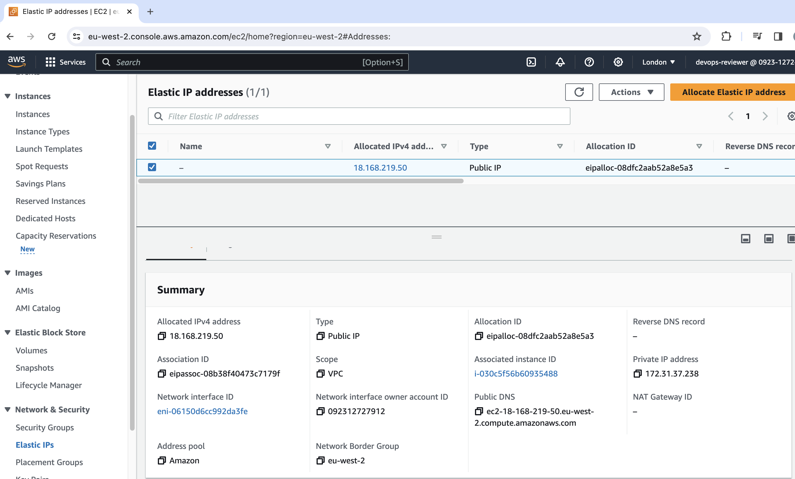
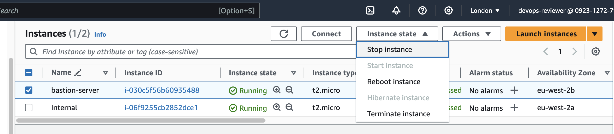
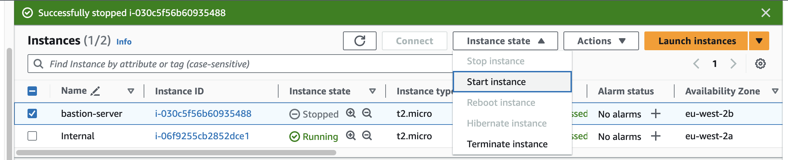

# Demo

We start from previously demo, where we have two instances running. The internal instance is only reachable from bastion instance. The problem that we face now is that our bastion instance is not associated with an elastic IP, so whenever we stop/run the instance the public IP will be revaluated and our connection setting throw away.

## Searching for instance

To assign an EIP, we need to know, the instance network interface unique identifier that we want to use. In our case the instance is the `bastion` one. So let's go ahead and try to solve this from AWS CLI. First let's grab all instance on london region:

```bash
aws ec2 describe-instances --region eu-west-2
```

We notice that we have a dedicated entry for network interface, inside the instance. The instance that we're interested on is just the `bastion` one so let's try to filter and grab only this one:

```bash
aws ec2 describe-instances \
 --filters "Name=tag:Name,Values=bastion-server" \
 --region eu-west-2
```

Now the response only comes with one instance. Now we need to get from overall response the network interface id:

```bash
aws ec2 describe-instances \
 --filters "Name=tag:Name,Values=bastion-server" \
 --region eu-west-2 | jq -r '.Reservations[0].Instances[0].NetworkInterfaces[0]."NetworkInterfaceId"'
```

We're going to need this value, so let's dump it into a variable:

```bash
ENI=$(aws ec2 describe-instances \
 --filters "Name=tag:Name,Values=bastion-server" \
 --region eu-west-2 | jq -r '.Reservations[0].Instances[0].NetworkInterfaces[0]."NetworkInterfaceId"')
```

```bash
echo $ENI
```

Now, allocate an Elastic IP address by running the `aws ec2 allocate-address` command. This will return an allocation ID.

```bash
aws ec2 allocate-address --region eu-west-2
```

We get a response similar to this one:

```json
{
    "PublicIp": "18.168.219.50",
    "AllocationId": "eipalloc-08dfc2aab52a8e5a3",
    "PublicIpv4Pool": "amazon",
    "NetworkBorderGroup": "eu-west-2",
    "Domain": "vpc"
}
```

From this response, ee need the `AllocationId`, copy the value and dump it into terminal variable:

```bash
ALLOCATIONID=eipalloc-08dfc2aab52a8e5a3
```

Now, associate the allocated Elastic IP with a network interface or instance using the `aws ec2 associate-address` command.

> NOTE: We can use a network interface or instance, in this demo we're using the network interface.

```bash
aws ec2 associate-address --allocation-id $ALLOCATIONID --network-interface-id $ENI --region eu-west-2
```

We get something as follows:

```json
{
    "AssociationId": "eipassoc-08b38f40473c7179f"
}
```

Move to EC2 dashboard on console and open `Elastic IPs`, we will find out our new EIP:



Let's try to connect to our bastion server using this info

```bash
ssh -i "london-key.pem" ec2-user@ec2-18-168-219-50.eu-west-2.compute.amazonaws.com
```

Ok, now let's `exit` the instance, and from AWS console let's `stop` the bastion server:

> Image 2


Wait untill is full stopped. Notice that the `public IP` doesn't change, even when we have stopped the machine, ok, let's start it again:

> Image 3


After is started, we can try previous SSH command and check that we can get into bastion server:

```bash
ssh -i "london-key.pem" ec2-user@ec2-18-168-219-50.eu-west-2.compute.amazonaws.com
```
