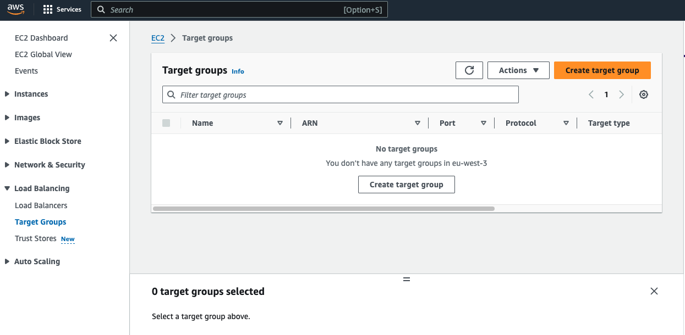
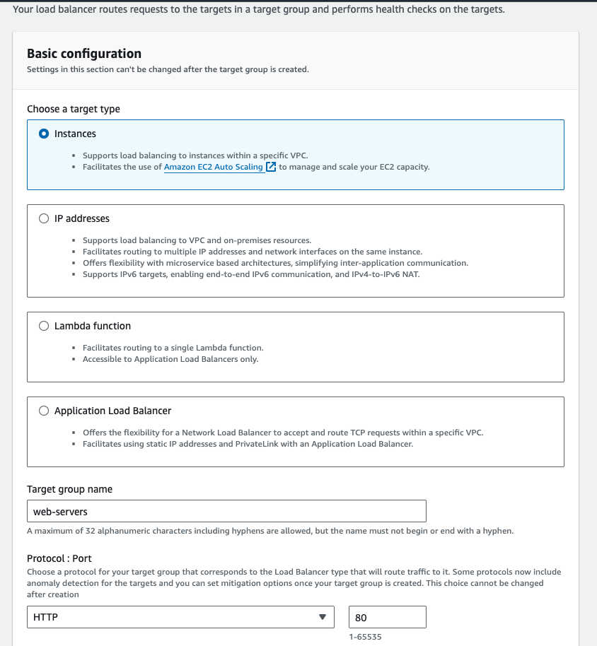
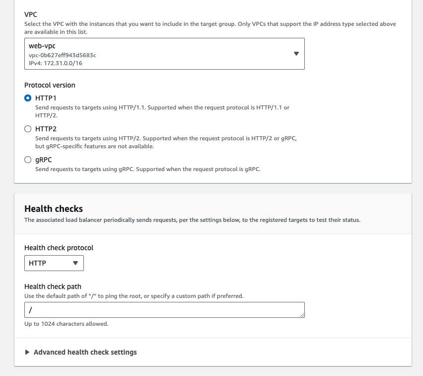
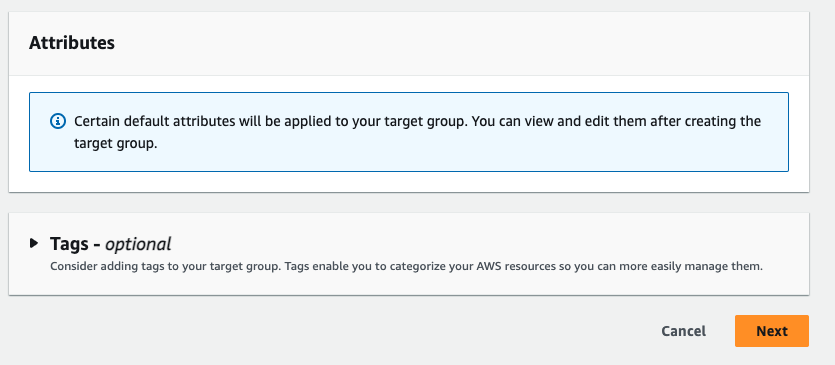
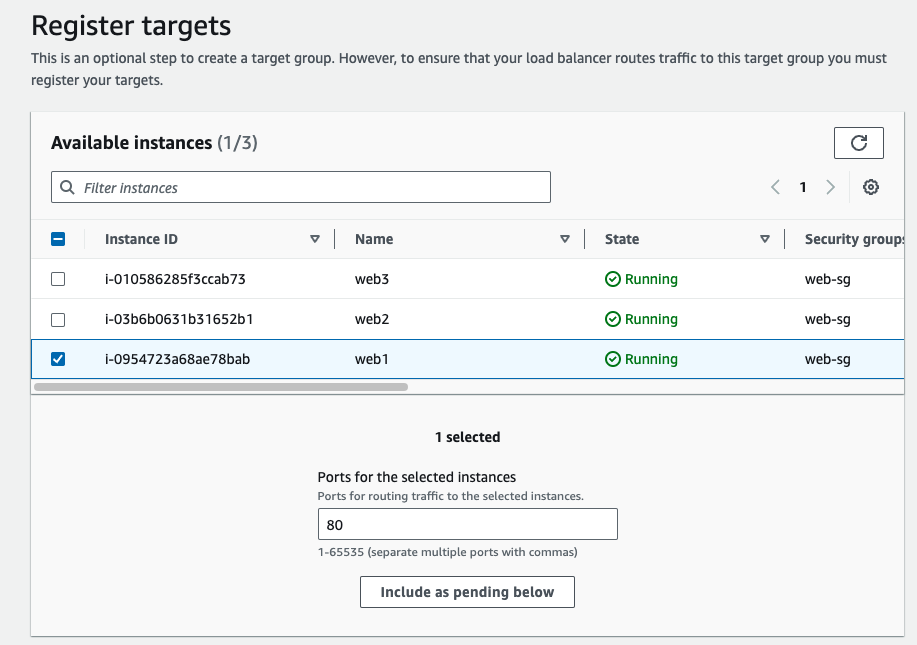
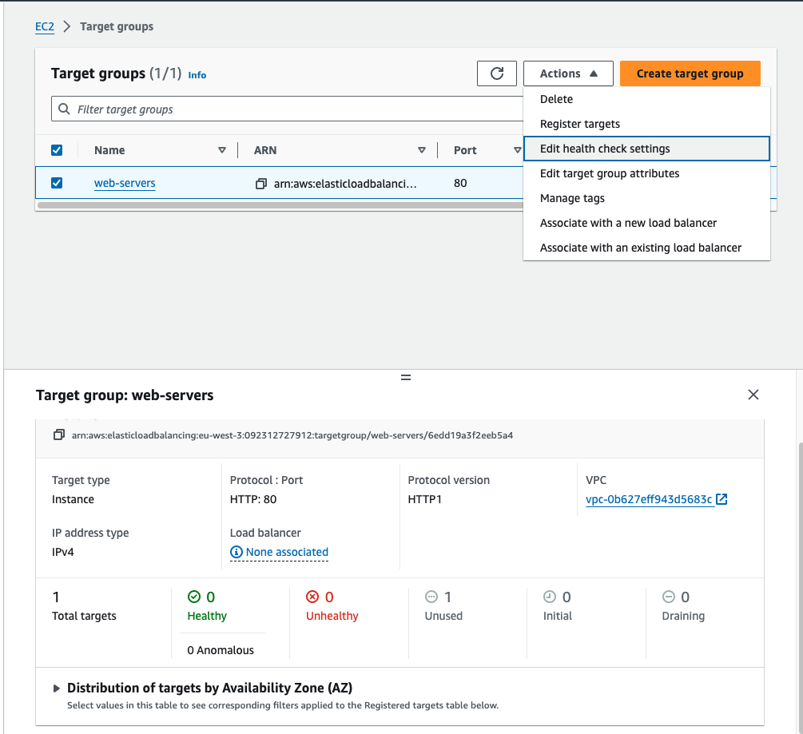
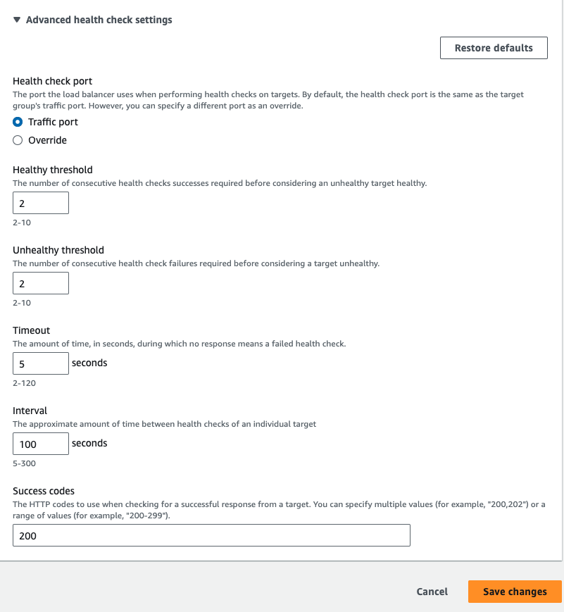
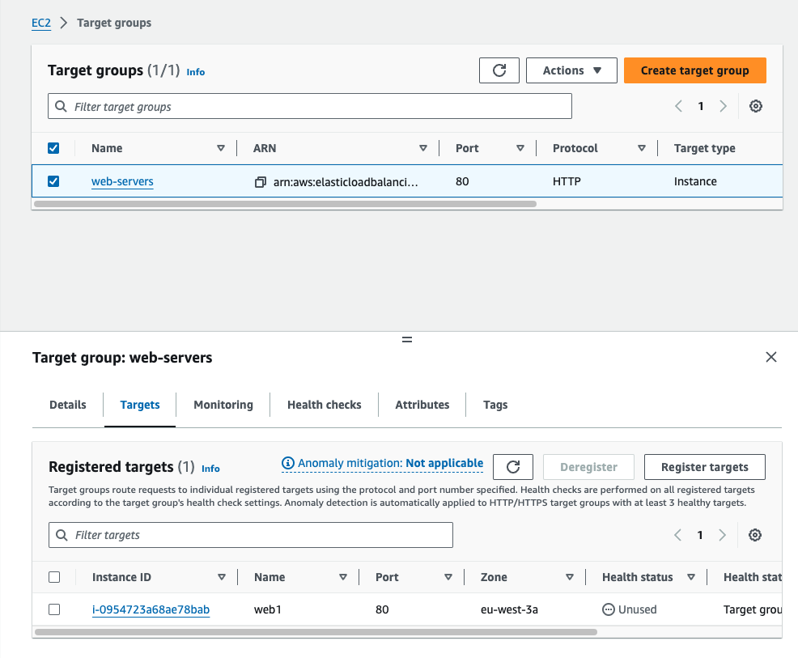

# Demo

> Open EC2, on Left menu `Load Balancing` -> Target groups

On the left side menu, scroll down to Load Balancing and click on Target Groups. Now, let's go ahead and click the Create target group button, and we are going to create an instances target group because our `web1` instance has only one IP address, which of course is its primary private IP address.

Scrolling down a bit, we're going to go ahead and name this group `web‑servers`, the protocol is HTTP, and the port is 80. 

Now for the VPC, we're going to go and hit the drop‑down here and select the `webapp‑vpc`, and for the protocol version we'll stick with HTTP1. 

Now let's go down to Health checks. Under Health check settings, we're going to specify the protocol and path to which AWS will send an HTTP GET request to determine if the target is healthy. 

We'll stick with HTTP for the protocol and the path is just the root as indicated by the forward slash. Now there are some more options under the advanced health check settings, but we're going to look at those in a moment. 

First, let's scroll down and click `Next`. 

Now we need to add `web1` to the target group, so let's go ahead and select a `web1` here, scroll down until you see Ports for the selected instances. Now the port here is the port on which the load balancer will send traffic to the instance. We can actually override the port on a per target basis. We're not stuck with the port we've configured in the target group settings. We're just going to stick with port 80 and click the Include as pending below button. 

Now, scroll down and notice that the instance and port pairing show up under Targets. This looks good, so let's **click Create target group**. 

Now, select the target group again, go to the Actions menu, and then click Edit health check settings. 

Now these are the same settings which were available when we were creating the target group a moment ago, but I wanted to go ahead and first register the `web1` instance to give these settings a little more context. 

Let's go ahead and expand the Advanced health check settings portion here. 

For the port setting, we can specify a particular TCP port for the health check. If we choose Traffic port, then the health check will use the same port that we registered the instance with, which is port 80. However, if we select Override here, we can explicitly specify port 80 just for the health check. 

For the `healthy threshold`, we'll set that to 2 so that each target has to pass a health check twice in a row to be considered healthy, and we'll leave the unhealthy threshold at 2 so that once the target fails two health checks, it will be removed from load balancing. 

Scrolling down a little bit, we're going to go ahead and leave the time out at 5 seconds, which should be more than enough time for each target to respond to the health check. And the interval between health checks, we're going to go ahead and set this at 10 seconds, not 100, 10 seconds. All right, there we go. 

Now for the success codes, we'll just stick with 200 OK, which is the standard HTTP status code for a successful request. All right, let's **click Save changes**. 

Now, make sure that the target group is selected, and on the bottom pane, let's go ahead and bring that up here, click the Targets tab, scroll down, and there's our one lonely target in zone 3a, and the status is unused because we have not yet created the load balancer. So, let's go do that now.