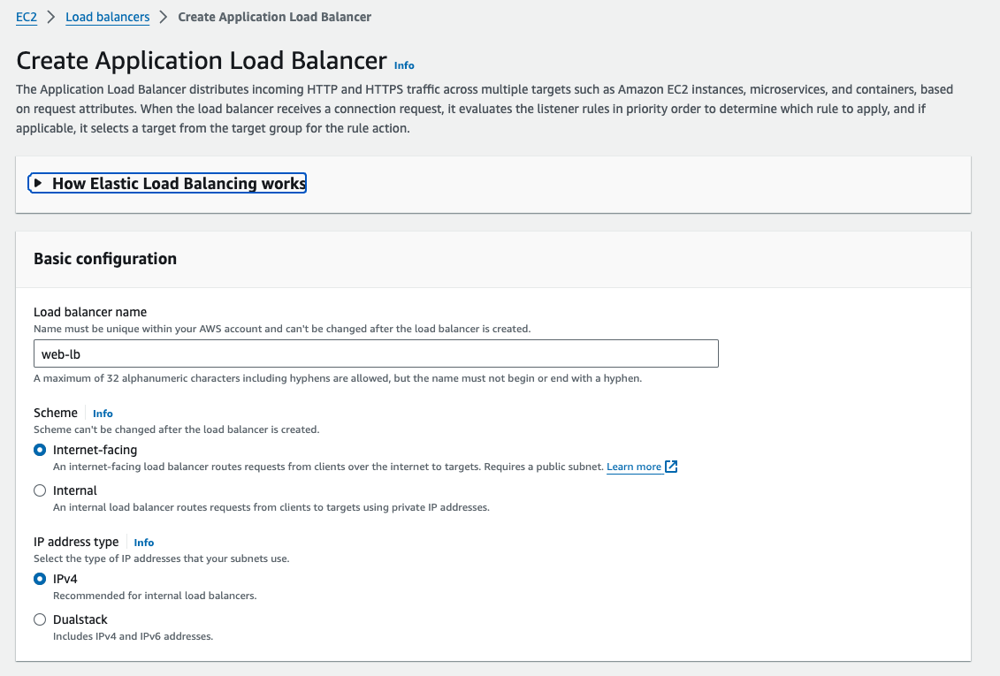
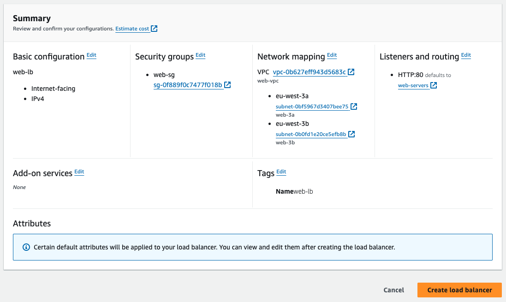

# Demo

Let's jump over to the AWS web console. Here we are at the EC2 console. Go ahead and click on the Load Balancers menu option and click the Create Load Balancer button. 

We're going to select the Application Load Balancer because we want the load balancer to actually terminate the HTTP connection. So click Create under that. 

Select `web-vpc`

Now we're going to configure which security group we want the load balancer to use. The security group we're choosing here gets associated with the elastic network interface, as I just mentioned. As part of the lab setup, we created a security group called `web‑sg` to allow HTTP and HTTPS traffic from any source. We'll go ahead and select that one, deselect the default one here, and then click Next. Here we can select the target group we created.

And we're going to give this a name of `web‑lb`. 

The scheme is `internet‑facing` because we want the load balancer to be accessible from the internet. By choosing Internet‑facing instead of Internal, we're making sure that the load balancer gets assigned publicly routable IPv4 addresses. And for the IP address type we can select `Ipv4` or we can select `dualstack`, which will give the listener publicly routable `IPv4` and `IPv6` addresses. Selecting `dualstack` makes it really easy to take our IPv4‑only web application, which does not support IPv6, and make it available on the IPv6 internet. This is something we're actually going to configure a little later. 

All right, go ahead and look under Listeners. By default, the load balancer will listen on TCP port 80 for HTTP requests. That's fine for now. Later on when we set up secure HTTPS access, we're going to revisit the listener settings, but for now we'll stick with HTTP. 

Go to the Target group drop‑down and click Existing target group, and it shows us the target group settings, which of course we've already reviewed. So this looks good.

And next, we're going to have to select two subnets, one in each availability zone. Click on `eu-west-3a`, and then select the web1a subnet right here. Then click the `eu-west-3b` checkbox and select `web-3a`. All right, there we go. 

The listener **will have two elastic network interfaces, one in each availability zone, and we are selecting which zones those interfaces should go in**. Double check and make sure that the web-3a and web-3b subnets are selected, and let's jump down to `Tags`. Expand Tags here. 

We're going to go ahead and create a name tag, and we're going to call this one `web‑lb`. That is it for this page. 

Let's review the Summary and click `Create load balancer` 

And the load balancer is successfully created. Great. Let's click `View load balancer`. 

Now initially it's in a provisioning state and it can take about a minute or so before it finally becomes active. 

All right, now that it's active, let's go check on the health of our target, web1. We'll go back down to Target Groups right here and click on the Targets tab, refresh this here, and the one instance we have as a registered target is showing healthy. 

So we're almost ready to test out the load bouncer, but before we do that there are a couple more things I want to show you.