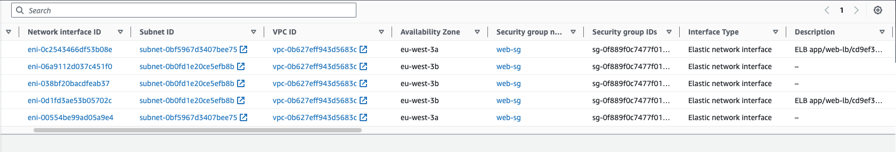

# Demo

Let's jump back to the Load Balancers dashboard and look under the Description tab where it says DNS name.

This is the publicly resolvable DNS name of the load balancer. Notice it begins with `web‑lb`, which is of course is the name we assigned to the load balancer. 

Let's browse to it. This looks familiar. It's the front end of our web application. But, some items are different. Under the Client Information, the client IP address is 172.31.1.225. What is that? That's one of the internal IPs of the load balancer. Specifically, it's the IP address of one of the elastic network interfaces that the load balancer is using. All right, keep that address in mind and let's go look at those interfaces.

We'll jump back to the EC2 service console. Click on Network Interfaces and locate the elastic network interface with that private IP address.

On this I highlighted here, look at the primary private IP address, 172.31.1.225. Looks familiar, right? It's the same address. When the load balancer proxies traffic to the web front end, it uses this as the source address. You'll also notice that this network interface is in zone 3a. Recall that when we set up the load balancer, we had to select two subnets in two different zones. This interface is in zone 3a. 

If I select the other interface, notice this interface is in zone 3b. It has a different primary private IP address, if I scroll over here, and that is in the other subnet, 172.31.2.189. 

So this is how the application load balancer achieves resiliency. If one availability zone fails, the load balancer has an elastic network interface in the other zone. 

Lastly, notice the `web‑sg` security group is associated with both of these interfaces.

You can see that right here and right up here. How did that happen? Remember when we created the load balancer we associated it with this security group. Let's take a look at the security group again. We've already discussed how the inbound rules and the security group control which public IP addresses may connect to the load bouncer, but there's another side of the security group, the outbound rules. Let's look at those.

By default, any security group you create will allow all outbound traffic, but what will happen if were strict to this? Suppose we don't allow any outbound traffic to originate from any network interface associated with this security group. Let's find out, shall we? Let's go and click on Edit outbound rules. Let's go ahead and remove both of these rules, we'll just click Delete and then Save rules.

Now the group will deny all traffic originating from any network interface associated with it. Now let's jump back over to our target groups and take a look at our targets. 

Notice that the `web1` instance is now showing unhealthy. Why? Well, it's because it failed the health checks. Why did it fail the health checks? Because the security group is preventing the load balancer from initiating an HTTP connection to the instance. So the moral of the story is that if you ever adjust the outbound rules of the security group associated with your load balancer, make sure that you at least open them up enough for the load balancer to perform its health checks and to forward traffic to the registered targets.

> Undo the last changes on security groups

