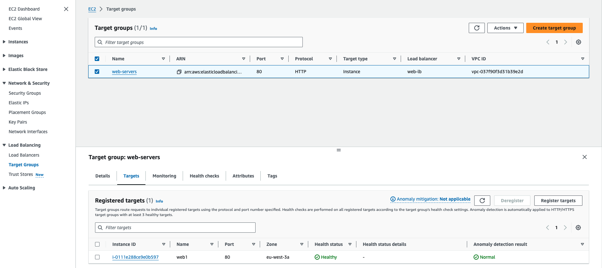
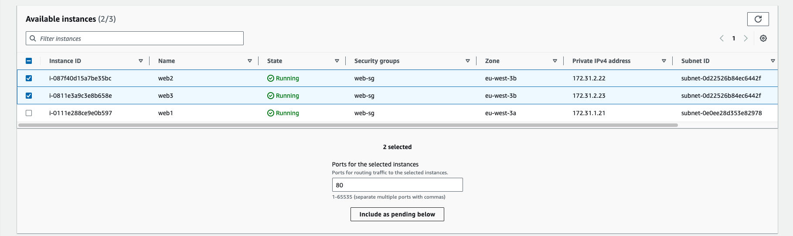
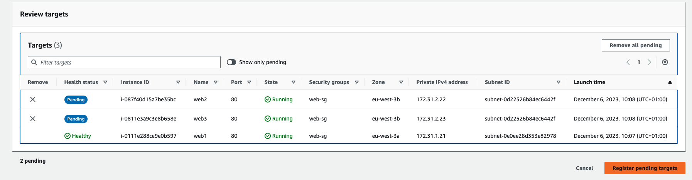
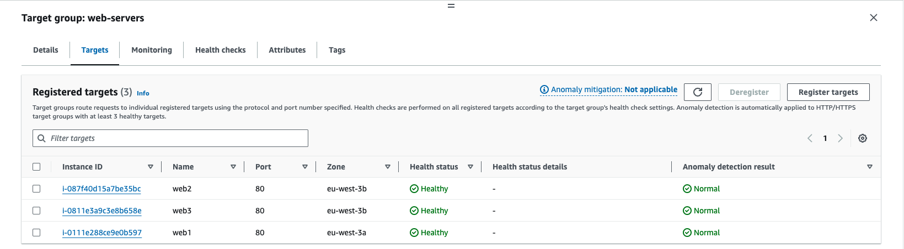

# Demo

Let's go ahead and bring up two more SSH sessions, one to web2 and another to web3. Here we are in our SSH session with web2. Let's go ahead and deploy the web server here. 

> SSH web2

```bash
docker run -d -p 80:3000 -h web2 jaimesalas/todo-app-front:4
```

All right, and while that is running, let's jump over to web3, and we'll go ahead and deploy it here on the web3 as well. 

> SSH web3

```bash
docker run -d -p 80:3000 -h web3 jaimesalas/todo-app-front:4
```


Now, let's jump back over to the **EC2 service console** and let's find our `web‑servers` **target group**. Go ahead and **click the Targets** tab and then the **Register targets button** 



And then here, let's go ahead and select web2 and web3, scroll down, **click Include as pending** below, 



and then we'll scroll all the way down to the bottom and click **Register pending targets**. 



Let's go ahead and do a quick refresh here and scroll up, and now all three instances are showing healthy. Great! 



All right, let's jump back to the web application. And then now, here, let's reload the page, and now we get load balanced to `web3`. Let's reload again, and now we hit `web2`. So, load balancing here is working great. 

Now, you might notice that the IP address under the Web Server Information is always 172.17.0.2, it doesn't change. That's because each Docker container is using the same internal IP address. This address is not reachable from outside of the container. Remember, earlier I said a container is essentially a virtual machine with its own internal IP address. 
