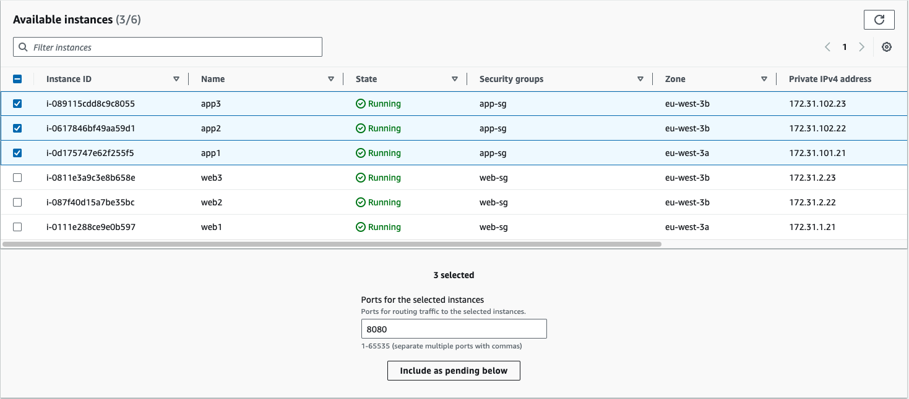
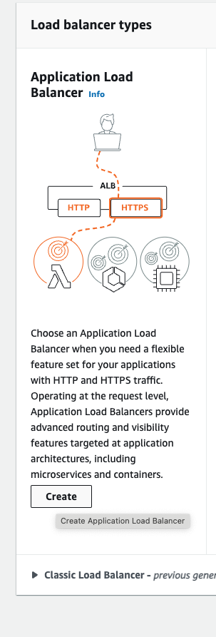
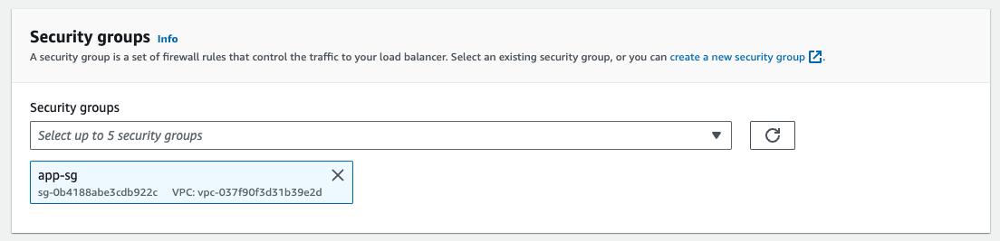
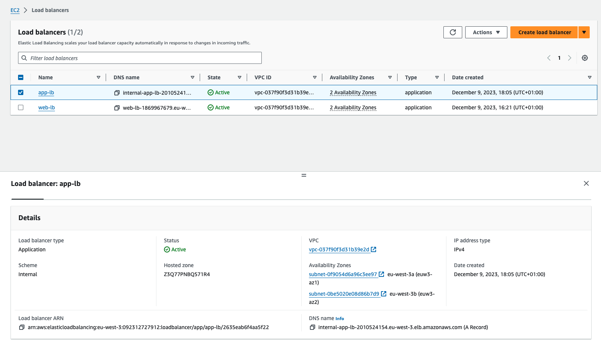

# Demo

We're going to deploy the application tier components to the `app1`, `app2`, and `app3` instances. After that, we'll create a new target group for those instances. And then finally, we'll create an application load balancer. Now, here's the command we're going to use to bring up the application to your components.

```bash
# To connect with mongo we need to provide MONGODB_URI
docker run -d -p 8080:3000 -h app1 jaimesalas/todo-app-api:4
```

It's very similar to the command we use to deploy the web front end on the web tier instances. Let's go ahead and Secure Shell into the `app1`, `app2`, and `app3` instances. 

Starting on `app1`, we'll spin up the Docker container for the application tier. In the interest of time, I'm going to paste the command in. 

Now the hostname of the container on this application server is going to be `app2`, and again, for the image I'm specifying `jaimesalas/todo-app-api:4`, which is the Docker image that contains the preconfigured application server.

```bash
# To connect with mongo we need to provide MONGODB_URI
docker run -d -p 8080:3000 -h app2 jaimesalas/todo-app-api:4
```

Now, let's jump over to the `app3` instance. And, of course, we are going to name this container `app3`. 

```bash
# To connect with mongo we need to provide MONGODB_URI
docker run -d -p 8080:3000 -h app3 jaimesalas/todo-app-api:4
```

Now, let's go ahead and jump over to the EC2 service console and create a new target group.

In the EC2 service console, click on `Target Groups` and let's click `Create target group`.


This is going to be an `instances` target group, and we are going to name this one `app‑servers`. Under the Protocol, let's click the drop‑down and here we've got several options, HTTP, HTTPS, TCP, TLS, UDP, and so on. We're going to work on HTTPS later. So for now, let's just go and select `HTTP`. The **port** here is going to be `8080`, which again is the port that the application servers listen on, and the `VPC` is of course going to be `webapp‑vpc`. And we are still using `HTTP1` here as well.


Now for the health check, we're going to go ahead and stick with `HTTP`, but in the path we're going to enter `/api/todos`, which is just a very simple page that displays information about the app server.


```
/api/todos
```

Now, let's expand the Advanced health check settings. Now this time we'll stick with Traffic port and set the healthy threshold to 2.


The rest of the defaults are fine, so scroll down to the bottom and click `Next`.

Now let's go ahead and select `app3`, `app2`, and `app1`, scroll down, click `Include is pending below`, scroll down a little more, make sure they're all there, app1, app2, and app3, and then click `Create target group`.




Now, let's go over to Load Balancers and click `Create Load Balancer`, select `Application Load Balancer`,




and let's name this one `app‑lb`. For the scheme it's going to be an **internal load balancer** because we don't want it to be open to the internet.


It should receive traffic only from the web servers. For the IP address type, notice we have only one option, `IPv4`. Now for the listener, we want to stick with HTTP and we're going to use port `8080` just to keep it consistent with the destination port we configured on the target group.


Scrolling down two Availability Zones, we're going to select the `webapp‑vpc`. For eu-west-3a we're going to select the `app‑1a` subnet, and for eu-west-3b, of course, the `app‑1b` subnet.


Notice it tells us there's an internet gateway attached to these subnets. In our VPC, we've got an internet gateway attached to a route table which is associated with those subnets. The only reason we did this is so that we could SSH directly to each of the app server instances to set them up.

Add security group



Let's go ahead and click `Next`. Once again we get the warning we got earlier about not using HTTPS. Let's click `Next`. 

And for the security group we're going to select `app‑sg` and deselect the default security group and click `Next`. And then we'll select an Existing target group and we will choose the app‑servers target group that we just created. Scroll down, click `Next: Register Targets`, and there are our targets. Go ahead and click `Next` again, give the settings a once over.

Add load balancer tags


Well, it looks good.


Click `Create`, and then click Close.

Now, let's go locate the DNS name of the new load balancer and copy it to our clipboard. So click on `app‑lb`. And then here's the DNS name. Go ahead and copy that to your clipboard by clicking the little icon there.



We're going to need this in just a moment. By the way, because this is an internal load balancer, this fully qualified domain name is only resolvable from within the `VPC`. There is no way to access this address from the internet. 

Now let's jump over to our Target Groups, select `app‑servers`, highlight the Targets tab, and after a moment there are our three healthy targets.


Now, we've got our web servers working and sitting behind an internet‑facing load balancer and we've got our application servers working and sitting behind an internal load balancer. When we configure the application target group, I directed the health check to use the path `/api/todos`.

## HTTP Request and Response

To give you a clearer idea of what that health check actually does, this is what the HTTP request and response looks like. Using the app1 target as an example, the target group connects to app1 over TCP port 8080. It sends an HTTP GET request for `/api/todos`. This process is essentially the same as browsing to the URL you see here. Notice that the URL begins with HTTP and includes the port number 8080.

By the way, this pattern is going to become particularly important in the next clip when we reconfigure the web tier instances to point to the internal application load balancer URL. The URL ends with `/api/todos`, which again is the path specified in the HTTP GET request. If the GET request succeeds, then the app1 instance responds with an HTTP status code of 200 OK and the target group declares app1 to be healthy.

**Instance**: app1 (172.31.101.21)
**Protocol**: HTTP
**PORT**: TCP/8080
**Path**: /api/todos
**Request Method**: GET
**Request URL**: http://172.31.101.21:8080/api/todos
**Status Code**: 200 OK
