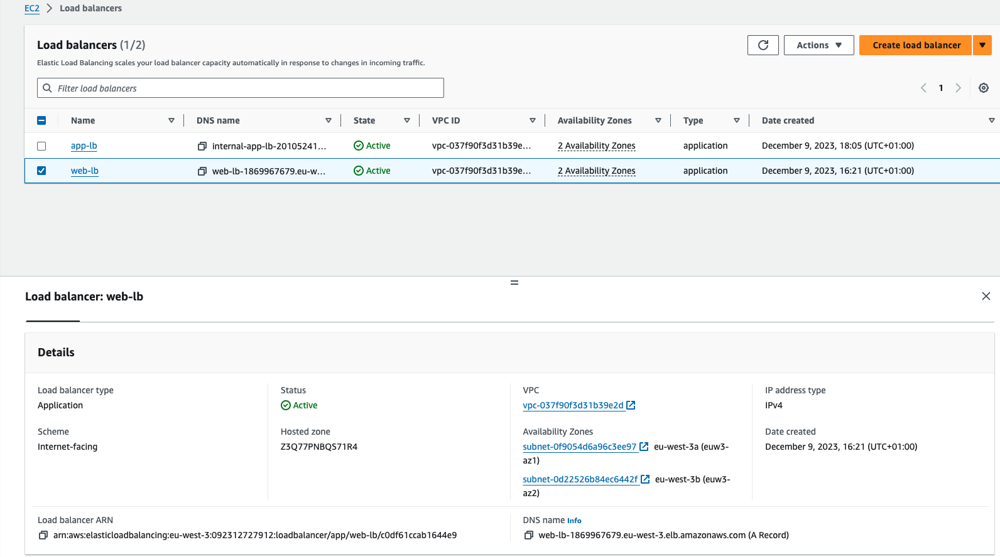

# Demo

In this demo, we're going to enable sticky sessions on the target group containing our web tier instances. We're not going to be making any changes to the applications tier in this module. Let's jump over to the AWS web console and get started. 

In the EC2 service console, browse over to your Target Groups and select the `web‑servers` group. 

Now click the Actions button and select `Edit attributes`. 

Scroll to the bottom and note that Stickiness is unchecked. Go ahead and check the box, 

and we've got two options for stickiness, `Load balancer generated cookie` or `Application‑based cookie`. 

The application doesn't use cookies, so we'll stick with a load balancer generated cookie. For the stickiness duration, you can specify a value anywhere from 1 second to 7 days. Let's go ahead and change this to `10 seconds`. 

Now here's what's going to happen. When we browse to the internet‑facing load balancer, it will proxy us to a web server and remember which web server it sent us to. Simultaneously, it will set a cookie with an expiration time 10 seconds in the future and it will send that cookie to us. Why 10 seconds in the future? Because that's the stickiness duration that we set, 10 seconds. With every subsequent request our browser makes to the load balancer, the browser will send that cookie to the load balancer. The load balancer checks the cookie and says ah‑ha, I remember you and I know which server you are connected to before, and it will proxy us along to the same web server. All right, makes sense.  

Let's click `Save changes`.Now let's please browse to the load balancer URL. 

We're going to go back over here and just hit Refresh (on browser). Now this time we are hitting `web3`. Let's go ahead and refresh again. There we go. Now notice a cookie popped up here, this big old long cookie named `AWSALB`. 

Now the value of this cookie is really a long encrypted string. I have no idea what's in it and only Amazon is able to decrypt it, but that's okay because we don't need to be concerned with the contents, we just want to see that the cookie is there. The `AWSALB` cookie is how the load balancer uniquely identifies and keeps track of us so that every time we refresh we hit the same web server. 

Let's go ahead and refresh again. During the time I was talking, more than 10 seconds elapsed, of course we got bounced over to `web3` this time. 

Let's refresh again quickly now, and we go back to `web3`. If I refresh it again, we are still on `web3`. The load balancer sets this cookie on the client, and with each subsequent request the client sends this cookie back. Let's go ahead and refresh one more time, and now it's been a little over 10 seconds, we are on `web2` this time. 

Remember, we set the stickiness duration to 10 seconds. During the time I was talking, more than 10 seconds elapsed, so when we refreshed, the load balancer once again executed its round robin algorithm to decide which server to send us to. For a real application, 10 seconds may not be long enough. 

So, let's jump back to the EC2 service console, let's go ahead and edit these attributes again, and I do have web‑servers selected there, not a lot of real estate, Actions, Edit attributes, and let's scroll down here, let's do something realistic like 5 minutes, and that makes a little more sense. 

`Save changes`.

Now let's jump back over to the web application, hit refresh. All right, this time we are hitting `web1`. Now this time I want you to pay attention to the cookie value. Just look at the first three characters, gk, and I think that's a capital I. All right, now let's refresh again, and notice that they change. Now it's op6. Let's refresh again, they change again. I'm going to refresh one more time, and of course they keep changing. 

Notice, however, despite this, we're still hitting `web3`. **We get a different cookie value, but we're still hitting the same server**. The value of the cookie changes on each request and it's also encrypted, which makes it pretty much impossible for someone to hijack your session by guessing or reusing the cookie value. Now it's been over 10 seconds. I'm going to refresh again, we are still on `web3`, as you can see the cookie value keeps changing over and over. So, this is working as expected.