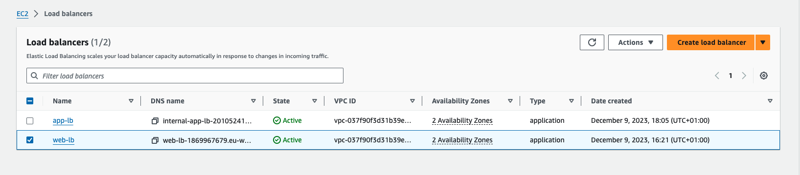
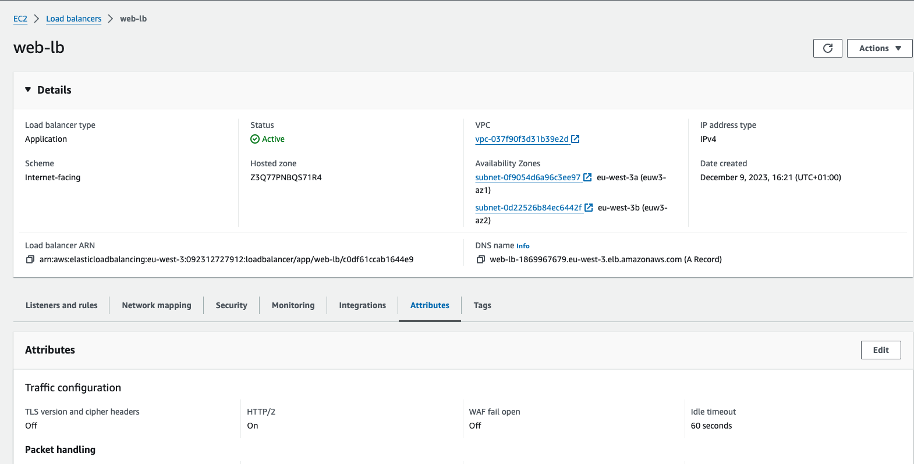
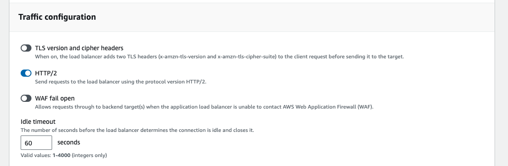
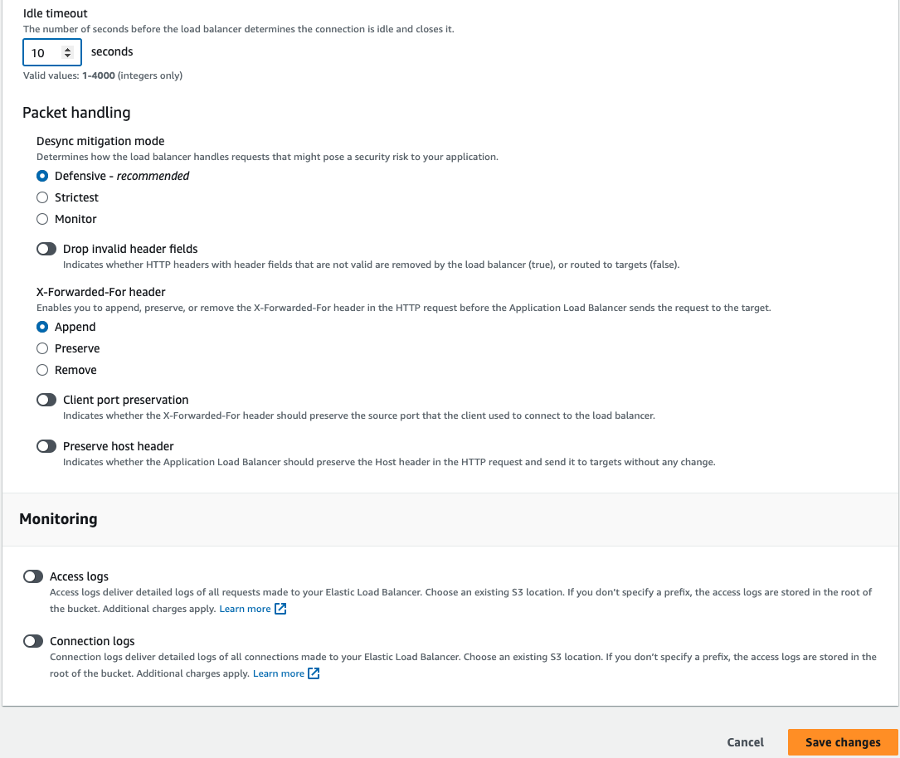

# Demo

> TODO: Create a page response with a 15 seconds delay on server

We're going to simulate a major slowdown in our web application and then configure an idle timeout and see how that affects our experience as a client. Here we are at the web app, and what I'm going to do is browse to a special page called shortdelay.py. 

Now this page does something rather strange. Once I hit Enter and the web server receives the HTTP GET request, it literally sits there and waits for 15 seconds. After 15 seconds, it displays the web server name. Now you might be like, that's weird Ben, what's the point of that? Well the point is that during that 15 seconds we had an open TCP connection to the load balancer, and that connection was idle. You see where I'm going with this? 

Let's jump back over to the EC2 service console and take a look at our load balancers. All right, let's select the `web‑lb` load balancer, click on the Description tab, and scroll all the way to the bottom to Attributes. Now, there is our idle timeout, 60 seconds. Go ahead and click on Edit attributes please, and we're going to change the idle timeout to 10 seconds and then click Save. 

All right, once it saves, let's jump back over to the web app. What do you think is going to happen when we reload this page? There's only one way to find out. I'm going to hit Refresh. Okay, and after 10 seconds we get a 504 Gateway Time‑out error. This error is coming from the load balancer. It's telling us, hey, you sent a request to the web server and the web server did not respond after a period of time, so I'm cancelling your request. Have a nice day. And in fact, we can refresh this over and over and we will get the same result. 

Our idle timeout is just too short. All right, but what if we set the idle timeout to 20 seconds, what will happen then? Let's go try it. Jump back over here, hit the Edit attributes button again, and we're going to change the idle timeout here to 20 seconds and hit Save. Now, why 20 seconds? Well, we know the web page has a built‑in delay of 15 seconds. It's going to sit idle for exactly 15 seconds and then boom, start sending data. So an idle timeout of 20 seconds will allow 5 seconds of wiggle room before the load balancer closes the connection. All right, let's go try it. Tab back over here, refresh again, and there we go. Our 20‑second timeout seems to be working. So, we're going to leave it at that.