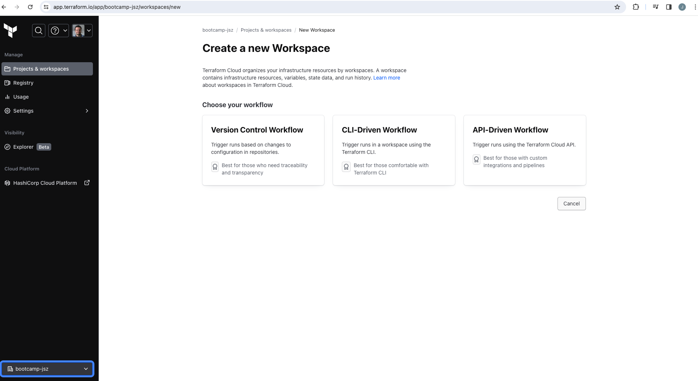

# Terraform Cloud Set Up 

You can easily get to the Terraform Cloud signup page using the link in the m4_commands. 

[Terraform sign up](https://app.terraform.io/public/signup/account)

If you already have an account, you can use that account. But we're going to create a new organization so it doesn't mess with any of your other resources. Follow the prompts to create a new account. And once you're signed in, you can create an organization called deep‑dive and then something like your initials. 

Create a new organization `bootcamp-jsz`

Organization names have to be globally unique. So if yours is already taken, add your age to the end or something similar. Take note of the organization name you choose, you're going to need it later. I have an organization called deep‑dive‑globo, and the first screen will prompt you to create a new workspace. You can ignore that for now. We'll come back to it later. 



Heading back to the terminal, we are going to authenticate to Terraform Cloud in the terminal. So it will store an access token locally that Terraform can use to authenticate to Terraform Cloud. To do that, we're going to use the Terraform CLI. We're going to run the command terraform login. 

```bash
terraform login
```

It will prompt us to make sure that we do want to generate a new access token. I'll enter yes. 

This will open up a window for Terraform Cloud, and if you're already logged in it will have you generate a user token. 

```
---------------------------------------------------------------------------------

Open the following URL to access the tokens page for app.terraform.io:
    https://app.terraform.io/app/settings/tokens?source=terraform-login


---------------------------------------------------------------------------------
```

Give it a name like deep‑dive‑token.

Name token `bootcamp-token`

Update the expiration to however long you think you'll need it and click on generate token. Once the token is created, copy the value and paste it back into the `TERMINAL`. You may also want to save this token somewhere safe in case you need it again later. 

> By default Terraform will save the token on `~/.terraform.d/credentials.tfrc.json`

Once you navigate away from the tokens page, the value will be hidden and you won't be able to retrieve it again. You should see a welcome message if everything has gone well. 

```
Retrieved token for user jaimesalas


---------------------------------------------------------------------------------

                                          -                                
                                          -----                           -
                                          ---------                      --
                                          ---------  -                -----
                                           ---------  ------        -------
                                             -------  ---------  ----------
                                                ----  ---------- ----------
                                                  --  ---------- ----------
   Welcome to Terraform Cloud!                     -  ---------- -------
                                                      ---  ----- ---
   Documentation: terraform.io/docs/cloud             --------   -
                                                      ----------
                                                      ----------
                                                       ---------
                                                           -----
                                                               -


   New to TFC? Follow these steps to instantly apply an example configuration:

   $ git clone https://github.com/hashicorp/tfc-getting-started.git
   $ cd tfc-getting-started
   $ scripts/setup.sh
```

Now we can get ready to configure our backend.
