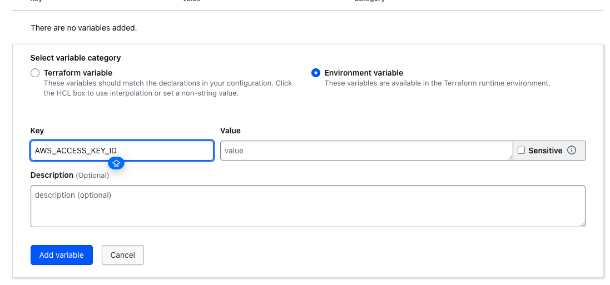
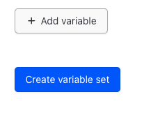

# Migrating state data

Back at the terminal, we already have our configuration all set, so we're simply going to run terraform init. And I'll expand out the TERMINAL so we can see all of the output while that's running. 

```bash
cd .lab/network_config
```

```bash
terraform init
```

```
Initializing Terraform Cloud...
Do you wish to proceed?
  As part of migrating to Terraform Cloud, Terraform can optionally copy your
  current workspace state to the configured Terraform Cloud workspace.
  
  Answer "yes" to copy the latest state snapshot to the configured
  Terraform Cloud workspace.
  
  Answer "no" to ignore the existing state and just activate the configured
  Terraform Cloud workspace with its existing state, if any.
  
  Should Terraform migrate your existing state?

  Enter a value: 

```

> Prompt us to migrate state -> yes

After this operation `terraform.tfstate` is **empty**

```bash
terraform plan
```

There's two important things to note about Terraform cloud. First is that migrating your state data off Terraform cloud is a bit of a process at the moment if you need to, I have a whole blog post about it, but it's not as simple as just changing the backend.config. 

The second is that the plan actually gets run on a hosted agent in Terraform cloud. And that hosted instance doesn't have access to your local Aws credentials file. So the plan is going to fail because it can't authenticate to Aws in the output. It tells us Aws error failed to refresh cache credentials, which means it's missing the credentials. 

```
Terraform v1.6.4
on linux_amd64
Initializing plugins and modules...
╷
│ Error: No valid credential sources found
│ 
│   with provider["registry.terraform.io/hashicorp/aws"],
│   on resources.tf line 5, in provider "aws":
│    5: provider "aws" {
│ 
│ Please see https://registry.terraform.io/providers/hashicorp/aws
│ for more information about providing credentials.
│ 
│ Error: failed to refresh cached credentials, no EC2 IMDS role found,
│ operation error ec2imds: GetMetadata, request canceled, context deadline
│ exceeded
│ 
╵
Operation failed: failed running terraform plan (exit 1)
```

Let's head over to Terraform cloud and fix that and check out our state data over in the Terraform cloud. UI we are going to create a variable set that includes our AWS credentials and make it available to all workspaces. 

We'll do that by clicking on the settings area and then on variable sets, we'll create a new variable set called AWS creds and select the scope to apply globally. 


That means all workspaces will have access to this variable set under variables. We'll add two environment variables, be sure to have the environment variable type selected and not the Terraform variable type. 

Set upd the name for `variable set`


The first variable is AWS access key ID and the value is your AWS access key ID. The second variable will be a W SSE access key and the value is your aws secret access key. You should mark the secret access key as sensitive which prevents it from being viewed after it's saved. 




Once you've added both variables, click on create variable set. 



Now let's check out our workspace. Click on workspace at the top of the page and then on our workspace name since we haven't had a successful run yet, it's still waiting for the configuration code. But if we go into the states section, we can see our state data. Is there going back to the terminal? Let's kick off and apply and see what happens since we have those AWS credentials available, the apply should run successfully and our configuration will be loaded into the Terraform cloud workspace. 

```bash
terraform apply
```

We can go back to the Terraform cloud UI and verify that this run is going.