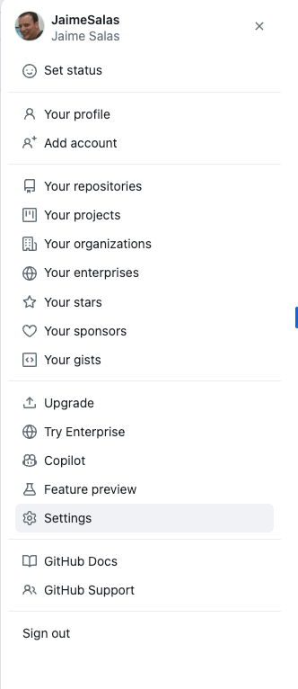
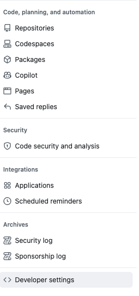
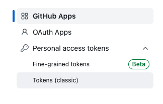
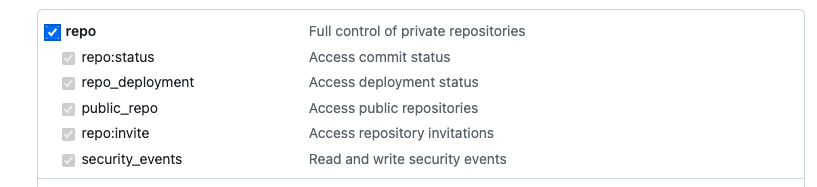
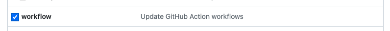
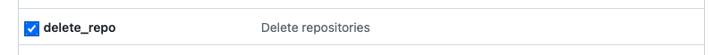

# Creating the GitHub Repository

On the GitHub page, I will go to my account settings, and then I'll scroll down to Developer settings. 





Then I'll select Personal access tokens and Tokens (classic). I'll click on Generate new token and then select Generate new token (classic). 



At this point, you may be prompted for your user credentials or an authentication code since creating a token is a privileged operation. On the next screen, I'll give my token a name. We'll call it `terraform‑bootcamp`. 

I'll leave the expiration as 30 days. But if you think you need more time, you can adjust it here. Under scopes, this is the permissions that the token has on your organization and repositories. I'll select all of the actions under repo. 



I'll also tick the workflow box. 



And scrolling down a bit more, I will select the `delete_repo` option so that we can clean up after ourselves later. 



That should be all the permissions we need for the personal access token. So scrolling down to the bottom, I'll click on generate token. 


Once you navigate away from this page, you won't be able to see the token again, so copy it and make sure you store it somewhere safe so you can refer back to it later. I'll copy my token and head back to Visual Studio Code. Back in Visual Studio Code, we are going to set the token as an environment variable. 

> In order to avoid issues with demos repo we will do next steps out of this repo. Head up to `terraform-deep-dive` (sibling directory) directory on M2

* Copy `.devcontainer` into `terraform-deep-dive`
* Copy `github_config` and `network_config` into `terraform-deep-dive`

I'll open up the TERMINAL, set the value of my personal access token, and then copy the command and paste it into the TERMINAL. 

```bash
export GITHUB_TOKEN=TOKEN_VALUE
```

Now we're ready to create a repository. 

```bash
cp -r 03-ci-cd/github_config/ ./.lab
```

First, I'll navigate into the `github_config` directory. 

```bash
cd ./lab/github_config
```

Then I'll run `terraform init` to initialize the GitHub provider. 

```bash
terraform init
```

Then I'll run `terraform apply` to create the repository. 

```bash
terraform apply
```

The repository name is going to be `globo‑networking`, but you can go into the configuration and change it if you want. 

Once the repository is created, we are going to push our existing `network_config` code up to it. 

Make note of the remote URL in the output as we're going to need that in a minute.

```
remote_url = "https://github.com/JaimeSalas/globo-networking.git"
```