# Terraform Cloud Integration

When we initially migrated our state to Terraform Cloud, we were using what is called the CLI workflow i.e. running commands against Terraform Cloud from the terminal, like we always have. Now we are going to shift to the VCS workflow, where the Terraform runs will be initiated based on events from our repository on GitHub. 

To set up the VCS workflow, we first need to connect our Terraform Cloud organization to our GitHub repository. Now we could do that by going through the Terraform Cloud UI, but that's no fun. Instead, we're going to use the Terraform Cloud provider and Terraform to do it. 

First, we'll head into the m5/terraform_cloud_config directory and we'll run the usual terraform init command to initialize the Terraform Cloud provider. 

```bash
cd terraform_cloud_config
```

```bash
# If we're not already log in
# use organization token
terraform login
```

```bash
export GITHUB_TOKEN=TOKEN_VALUE
```

```bash
terraform init
```

We already have our Terraform Cloud credentials stored from when we ran terraform login, and the TFE provider is configured to look for those cache credentials. We do need to pass the GitHub personal‑authentication token to the provider, and we already have that stored in the GITHUB_TOKEN environment variable, so we'll pass that in as part of the apply command. 

We also need to specify the name of the organization that we're using in Terraform Cloud. Mine is called deep‑dive‑globo, but set it to whatever yours is named. Just pick the version of the command that works with your shell and update the org name value to whatever you chose for your organization name, and then we'll run the command. I'll **enter yes when prompted**, and that's it.

```bash
terraform apply -var="gh_pat=$GITHUB_TOKEN" -var="organization=bootcamp-jsz"
```

```
Terraform will perform the following actions:

  # tfe_oauth_client.github will be created
  + resource "tfe_oauth_client" "github" {
      + api_url          = "https://api.github.com"
      + http_url         = "https://github.com"
      + id               = (known after apply)
      + name             = "tdd-github"
      + oauth_token      = (sensitive value)
      + oauth_token_id   = (known after apply)
      + organization     = "bootcamp-jsz"
      + service_provider = "github"
    }

Plan: 1 to add, 0 to change, 0 to destroy.
```

Now our Terraform Cloud organization is connected to our GitHub account. Next, we are going to update our workspace to use the globo‑networking repository. Back in the Terraform Cloud UI, you can find the GitHub connection under Settings for the organization and down in the VCS Providers section. 

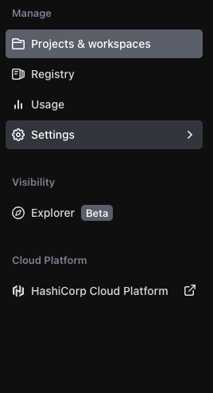

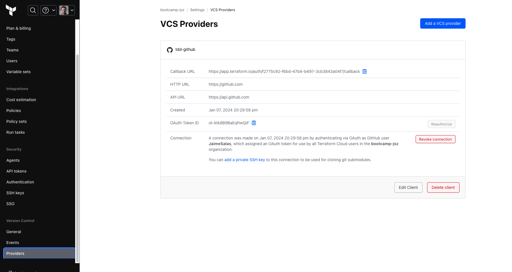

There's nothing to change here, but I wanted to show you where it was configured. Select the version control workflow and then the GitHub provider with the name TDD dash GitHub and then we'll select the global networking repository. 

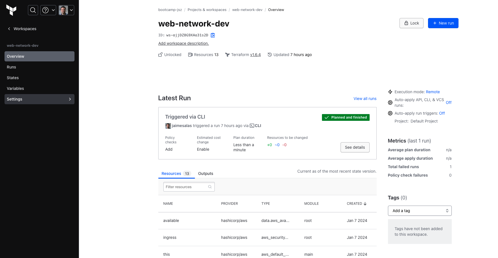

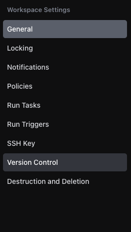

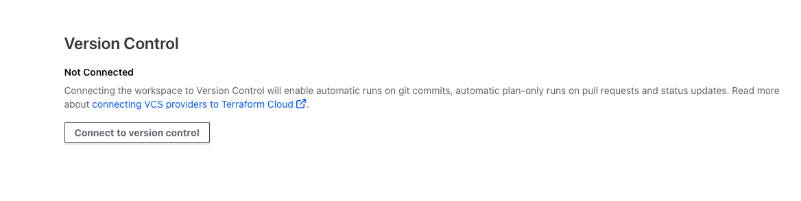

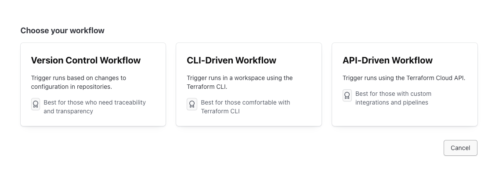

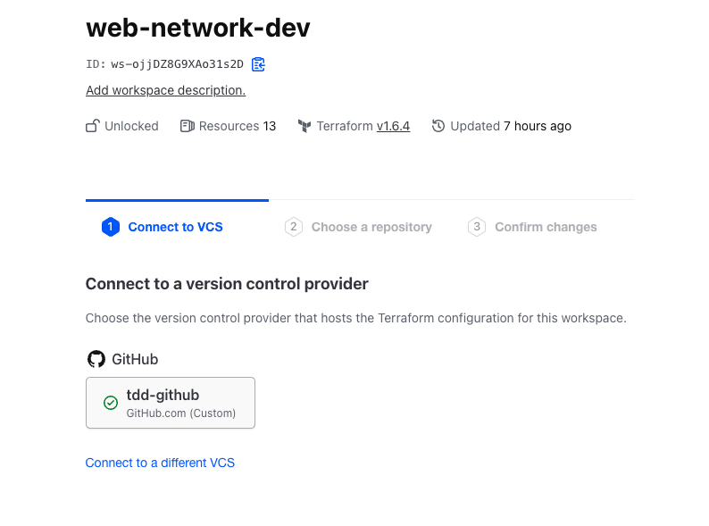

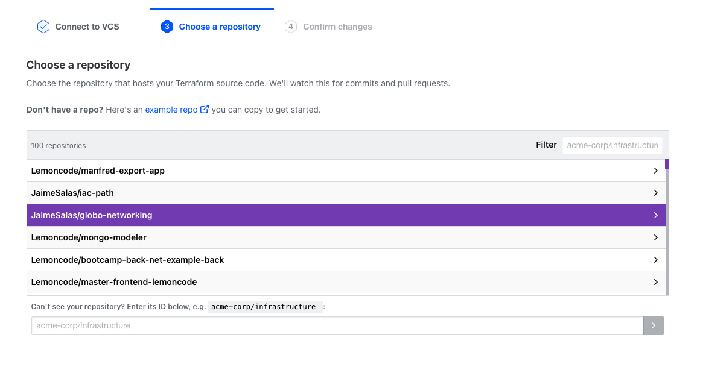

The last part of the wizard lets us select some additional options. If our Terraform code isn't in the root of the repository, we can specify a subdirectory to use as the working directory here. If we want to automatically apply changes. When a successful plan is run, we can select auto apply. But let's leave it manual for right now under VCS triggers, we can customize what Terraform is looking for to kick off a run. It can check for certain patterns or prefixes along a particular path or it can trigger when a particular git tag is published through releases. We're not going to use any of that. Instead, we'll set it to always trigger runs when a commit is pushed to the default branch, the pull request section will trigger a planning only run also known as a speculative plan. When there's a pull request against the tracked branch of the repository. This is a great way to get feedback on changes before they are merged into the default branch. We'll leave that box checked and click on update V CS settings. 

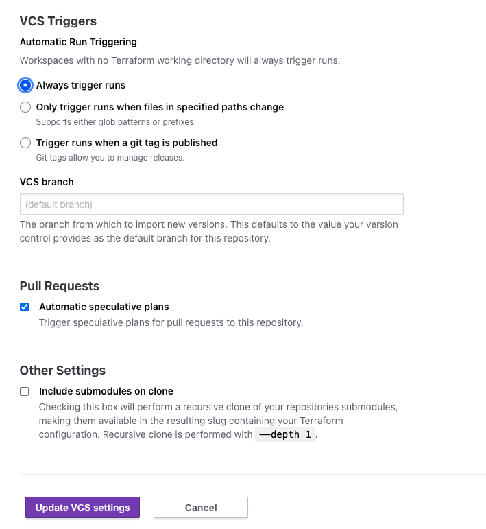

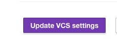

Once the settings are saved, let's run a plan and ensure that everything is working as expected. 

When you connect a workspace to a repository with the V CS workflow, it should automatically kick off a standard run, but let's add a new standard run just in case it didn't trigger, we'll go to actions, select, start a run and select the plan and apply run and then click on run. It looks like that run is now pending because another run is going. 

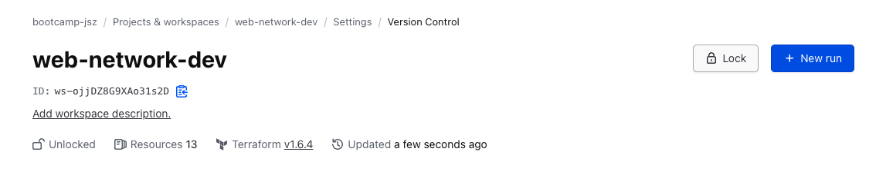

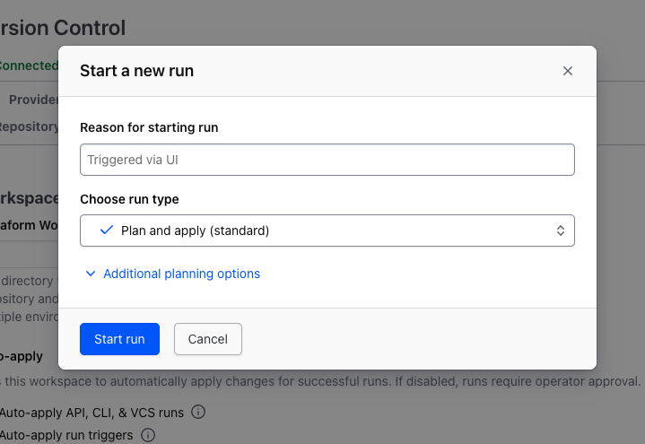

So let's click on the runs and see what's happening. It looks like it did successfully kick off the initial run when we connected it to the V CS repository. So if we wait for that one to finish, then the one triggered via the UI will run next, I'll jump ahead to when they have both completed. Ok. Both runs completed successfully and they're both in a planned and finished state which tells me there were no changes to be made and in fact, if we look at the triggered via U I run, it says plan finished and no changes, our infrastructure matches the configuration. 

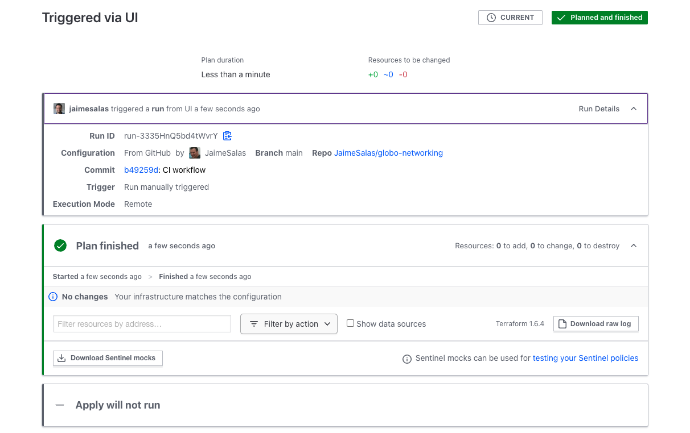

You might be wondering how this compares to other workflow automation tools. And the answer is that they're all pretty similar in terms of what triggers a run and what actions are taken. 

The main difference is that Terraform Cloud is specifically designed to work with Terraform. So it has a lot of built in knowledge about how to run Terraform commands and also how to handle state. We could have done everything with GitHub actions or added in Jenkins. But this is a lot easier to set up if you need a highly customized workflow, then another pipeline tool might be better. But for a basic Terraform plan and apply Terraform Cloud is a great option. And in our case, it's free now, let's put it all together and push a change from our local machine all the way through to the networking environment on aws.
