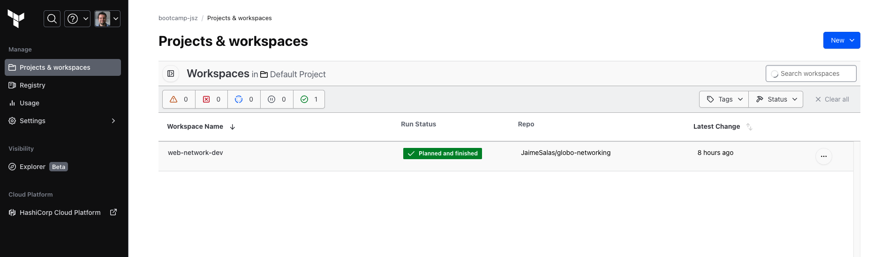
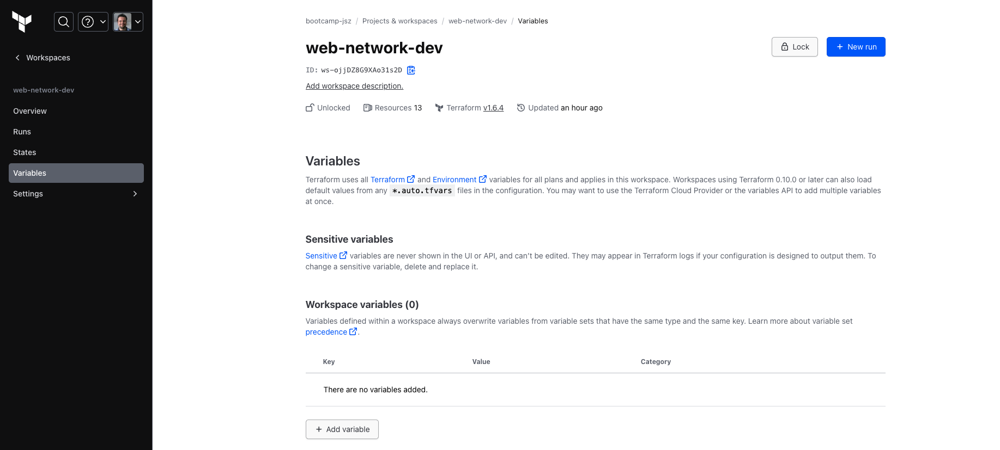
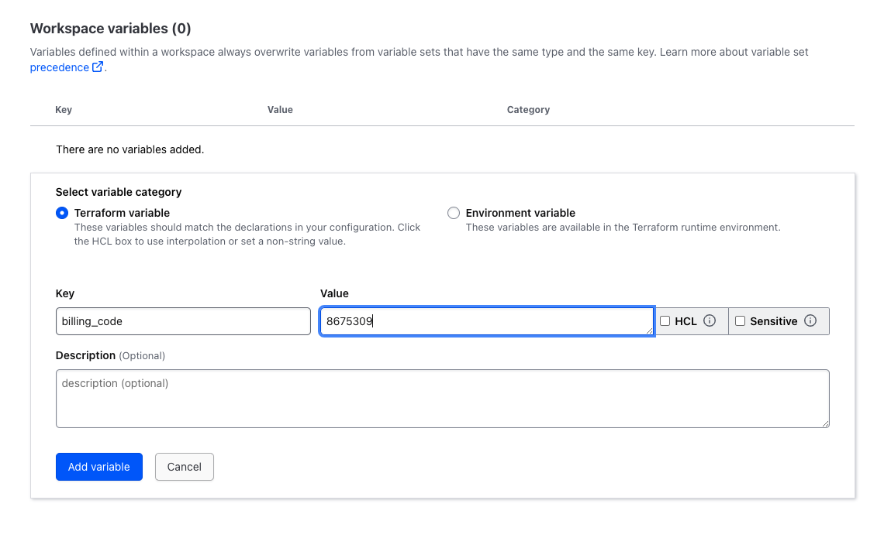
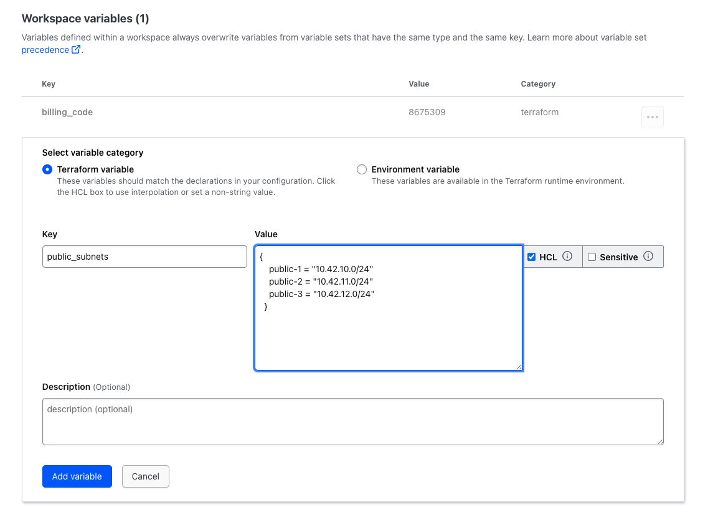

# Updating Code

We'll start locally. And first, I'll navigate back to the `network_config` directory, and then we'll add a new branch called `add‑third‑subnet` using the git checkout command. Then we'll make the necessary changes to the code. 

```bash
cd network_config
```

```bash
git checkout -b add-third-subnet
```

First, I'll open up the `variables.tf` file. And down below the variable environment, I'm going to add a new input variable here called `billing_code`. We'll set the type equal to string and then set a description of (Required) Billing code for network resources. 

Update `variables.tf`

```ini
variable "environment" {
  type        = string
  description = "(Optional) Environment for all resources"
  default     = "development"
}

# diff #
variable "billing_code" {
  type        = string
  description = "(Required) Billing code for network resources"
}
# diff #

variable "cidr_block" {
  type        = string
  description = "(Optional) The CIDR block for the VPC. Default:10.42.0.0/16"
  default     = "10.42.0.0/16"
}
```

I'm not going to set a default value, as we'll be setting the value up in the Terraform Cloud workspace. Next, I'll go into `resources.tf`. And under common_tags, I'll add another tag called billing_code, and I'll set that to our input variable BillingCode. 

Update `resources.tf`

```diff
##################################################################################
# RESOURCES
##################################################################################
locals {
  common_tags = {
    Environment = var.environment
+   BillingCode = var.billing_code
  }
}

```

Before we commit any changes, make sure to run terraform fmt so that our code is formatted properly and our GitHub Actions will pass. 

```bash
terraform fmt
```

We could also run validate locally as well, but let's let GitHub Actions do that for us. Next, we'll stage our updated files, and then we'll commit them with the message Add third subnet and tags, and then push our branch up to origin to a new branch that we'll create up there, also called add‑third‑subnet. 

```bash
git add .

git commit -m "Add a third subnet and tags"

git push --set-upstream origin add-third-subnet
```

This will create a new branch on GitHub and trigger our GitHub Actions to run. Heading over to the repository, it shows us that a new branch has been added. And if we go to GitHub Actions and check on the status, our most recent commit in the add‑third‑subnet branch has passed successfully. The next step is to create a pull request to merge the change into the main branch. But before we do that, we need to update our workspace with variable values. 

Over in Terraform cloud, we'll go to our workspace and select Variables. 





We'll add a new variable of type Terraform called billing_code and set the value of billing_code to 8675309. 



Then we'll add a new variable called public_subnets, and this one's a little different. Since the value isn't a simple string, we need to check the HCL box and then enter the value as a map of strings. We can go back to our code, copy the default value from our existing code, and then paste it into the box. And now we can add a third subnet. I'll give it a name of public‑3, and set the value to 10.42.12.0/24, following the pattern that we've already set out, and click on Add variable. 



Once we have our variable set, now we can head back to the repository and create a pull request.