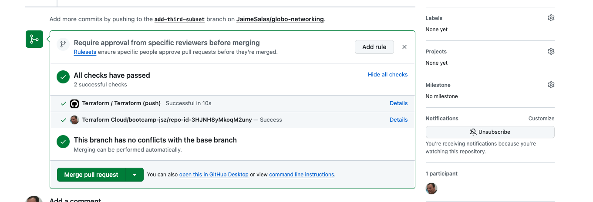
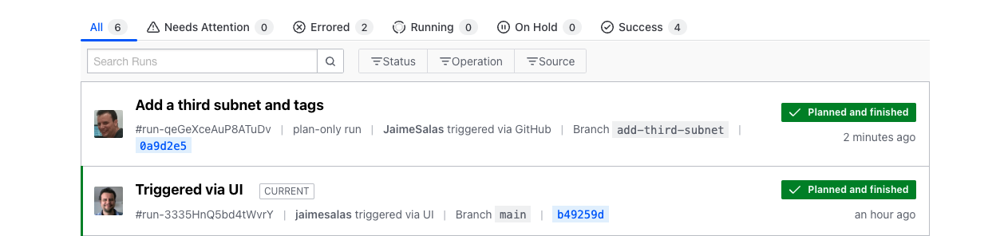
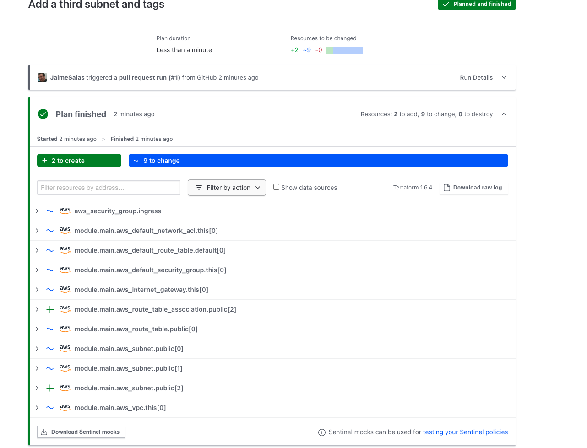
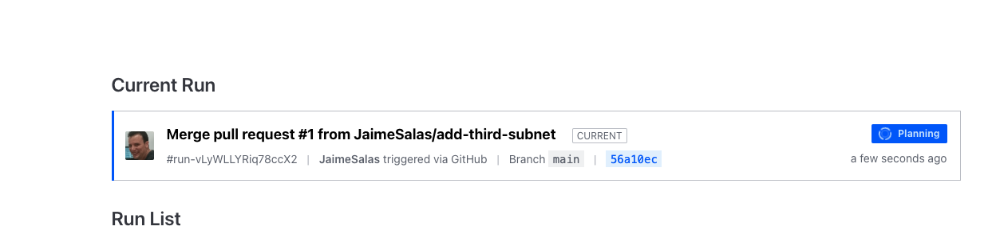
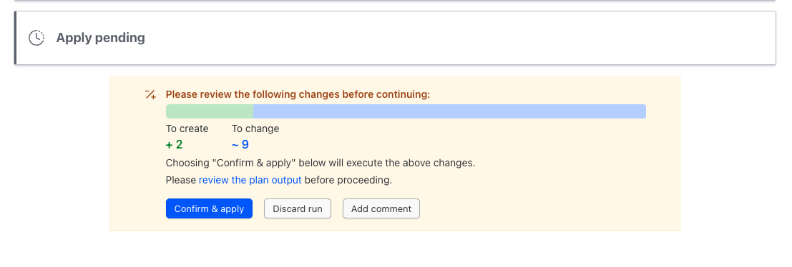
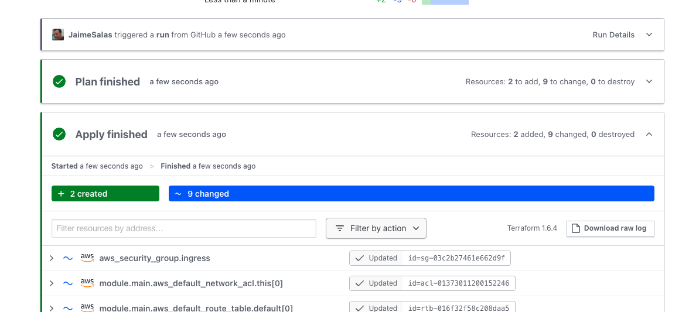

# Creating Pull Request

Back in the repository, we'll click on the Pull request tab and create a new pull request. We'll select our add‑third‑subnet branch as the compare and the default branch as the base. That will merge changes from the add‑third‑subnet branch into the main branch. I'll click on Create pull request. And if you'd like to, you can add some more detail in here. I'll simply click on Create pull request. 

Once that pull request has been created, it will see that it's already successfully run the CI portion of our GitHub Actions, so it will kick off the next test, which is a speculative plan over in the Terraform Cloud workspace. 

We can view the status of that run by clicking on Details. Looking at the status of the run, the plan has finished. 

It has two resources to add and nine to change. 

If we expand one of the changing resources, we can see that the BillingCode is being added. Scrolling down some more, there's a route_table_association that's being added, as well as a public subnet. That's what we would expect. But since this is a speculative plan only, we cannot apply it. But it will still at least let us know what the changes would be if we merged the pull request. 

Closing the run and going back to GitHub, it now shows us that both checks have successfully passed, and we can click on Merge pull request and **confirm the merge**. 

Now this code is being merged into the main branch, and we can delete our feature branch add‑third‑subnets. 

Heading back to Terraform Cloud and looking at the runs for this workspace, there is a new run that references the pull request that we just merged over in GitHub, and we can click on this current run to view the status of the run. 

It's going to run a fresh execution plan and then prompt us to apply the changes. Down at the bottom, it summarizes the changes that are going to happen, and we can click on confirm and apply, add a comment if we'd like to, and then confirm the plan, and now it's going to apply the actual changes to the target environment. 

The reason it runs a new execution plan is because the previous plan was only speculative in nature, and someone could have changed the environment in between when we ran the speculative plan and this new plan and apply. By running plan and apply, it locks the workspace from future changes and waits for us to either confirm the apply or reject the plan. 

And after a few moments, our apply has completed successfully. So congratulations. We've moved our Terraform code to a shared repository and implemented a CI/CD pipeline with GitHub Actions and Terraform Cloud to manage changes to the code and apply them to a networking environment. That is not an insignificant accomplishment.
