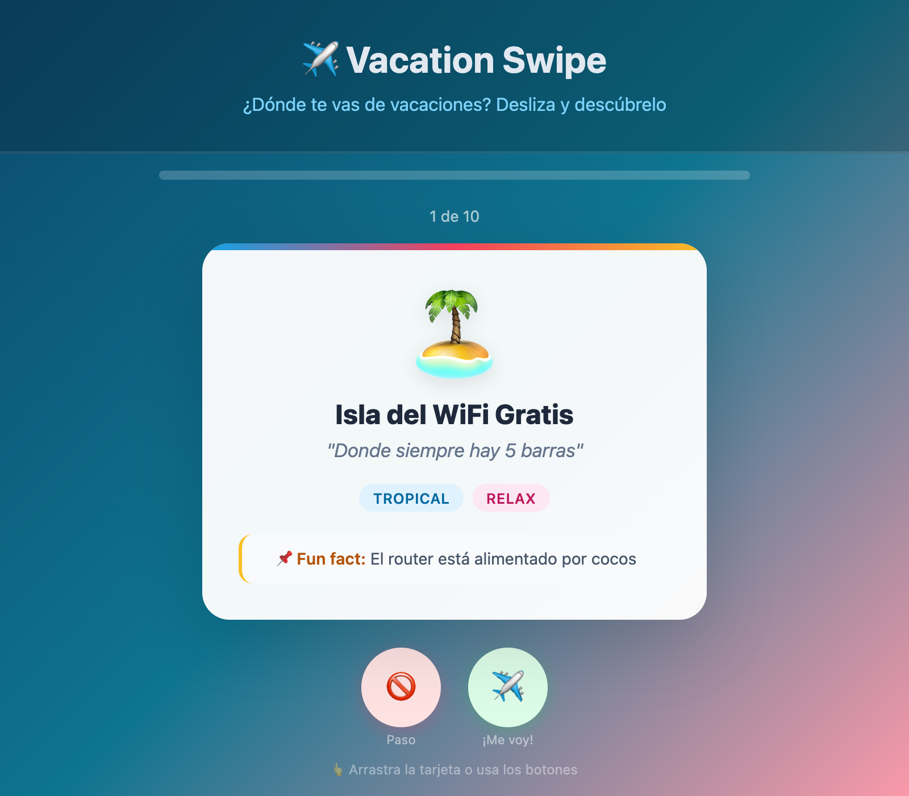

# ✈️ Vacation Swipe

> **¿No sabes dónde ir de vacaciones?** Desliza, elige y deja que el destino te encuentre a ti.



---

## 🎮 ¿Qué es Vacation Swipe?

**Vacation Swipe** es un mini-juego web tipo Tinder para elegir tu próximo destino de vacaciones. 
Se te presentan destinos ficticios (con mucho humor tech/DevOps) y tú decides:

- ✈️ **¡Me voy!** — Te apuntas al destino
- 🚫 **Paso** — No es para ti

Al final, si elegiste algún destino, se te asigna uno aleatorio de tus favoritos. 
Si no elegiste ninguno... ¡te quedas en casa viendo Netflix! 🏠🍿

---

## 🏝️ Destinos disponibles

Algunos de los destinos que podrás encontrar:

| Destino | Descripción |
|---------|-------------|
| 🏝️ **Isla del WiFi Gratis** | Donde siempre hay 5 barras |
| 🏔️ **Montaña del Lunes Festivo** | Aquí todos los días son viernes |
| ☕ **Ciudad del Café Infinito** | Las fuentes públicas son de cold brew |
| 🌋 **Volcán del Deploy a Producción** | Vive al límite (literalmente) |
| 🏖️ **Playa del Código Limpio** | Donde todos los PRs se aprueban a la primera |
| 🧊 **Glaciar del Inbox Zero** | 0 emails no leídos, garantizado |

---

## 🛠️ Stack tecnológico

- **Backend:** [FastAPI](https://fastapi.tiangolo.com/) (Python)
- **Frontend:** Web Components nativos (sin frameworks)
- **Base de datos:** SQLite
- **Estilos:** CSS vanilla

---

## 🚀 Instalación

```bash
# Clonar el repositorio
git clone https://github.com/0GiS0/vacation-swipe.git
cd vacation-swipe

# Crear entorno virtual
python -m venv .venv
source .venv/bin/activate  # macOS/Linux
# .venv\Scripts\activate   # Windows

# Instalar dependencias
pip install -r requirements.txt

# Ejecutar la aplicación
python app.py
```

La aplicación estará disponible en:
- 🌐 **Web:** http://localhost:8000
- 📚 **API Docs:** http://localhost:8000/docs

---

## 📡 API REST

| Método | Endpoint | Descripción |
|--------|----------|-------------|
| `GET` | `/api/destinations` | Lista todos los destinos |
| `GET` | `/api/destinations/{id}` | Obtiene un destino por ID |
| `POST` | `/api/destinations` | Crea un nuevo destino |
| `PUT` | `/api/destinations/{id}` | Actualiza un destino |

---

## 📁 Estructura del proyecto

```
vacation-swipe/
├── app.py              # Entry point de FastAPI
├── routes.py           # Endpoints de la API
├── models.py           # Modelos Pydantic
├── data.py             # Capa de acceso a datos (SQLite)
├── destinations.db     # Base de datos SQLite
├── requirements.txt    # Dependencias Python
└── static/
    ├── index.html      # Página principal
    ├── styles.css      # Estilos
    └── components/     # Web Components
        ├── destination-card.js
        └── vacation-game.js
```

---

## 🤝 Contribuir

¡Las contribuciones son bienvenidas! Revisa las [issues abiertas](https://github.com/0GiS0/vacation-swipe/issues) para ver en qué puedes ayudar.

---

## 📄 Licencia

MIT License - Siéntete libre de usar este proyecto como quieras.